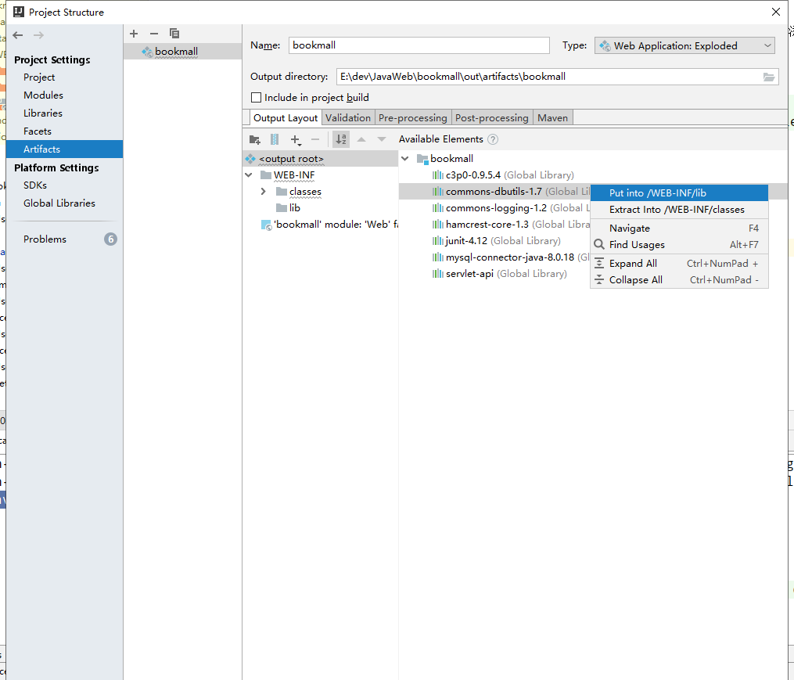

Book Mall注册、登录
==


## 效果图
首页
  

登录页
  

注册页
  

## 新建bookmall项目
新建项目，命名为bookmall，类型为Java EE，选择Web Application

    
## 需求
* 需求1：用户注册
    * 访问注册页面
    * 填写注册信息，提交给服务器
    * 服务器上保存用户信息
    * 当用户不存在时，提示用户名已经存在，注册失败，
    * 用户不存在时，注册成功
* 需求2：用户登陆
    * 访问登录页面
    * 填写用户名密码后提交
    * 服务器判断用户名是否存在
    * 如果登录失败，提示用户名或密码错误
    * 如果登录成功，跳转登录页面

## JavaEE项目的三层架构
* 分层的作用  
解耦合，方便后期代码的维护、升级，代码模块的复用


### 分层后的代码结构


```text
* web层的包
   com.bookmall.web
   
* 业务层的包
    com.bookmall.service  // 业务层接口包
    com.bookmall.serviceimpl  // 业务接口的实现包
* 持久层的包
    com.bookmall.dao  // 持久层DAO接口包
    com.bookmall.daoimpl  // 持久层DAO的实现包
    
* 实体bean包
    com.bookmall.bean
    
* 工具类包
    com.bookmall.utils
    
* 测试包
    test.com.bookmall
```
添加测试case实例方法，选择打开的类文件，光标点到类名上，按Alt + Insert，如图，这样会自动添加到测试包下
  


## 实现步骤
1. 创建数据库、表
2. 创建一个动态的Web工程
3. 把美术设计好的html页面拷贝到我们工程中
4. 给工程创建不同的包。实现代码架构上的分层
5. 创建Bean包下的类User实体类
6. 创建Utils包下工具类JDBCUtils类	(通过c3p0数据库连接池获取连接)
7. 在test测试包下，编写JDBCUtils工具类的测试代码
8. 创建dao.impl包下，BaseDao抽象类
9. 在test测试包下，编写BaseDao的测试代码。
10. 根据业务需求创建UserDao接口和UserDaoImpl实现类
11. 根据业务创建UserService接口和UserServiceImpl实现类
12. 在test测试包下，编写UserService接口的测试代码。
13. 在servlet包下，编写Web层与客户端交互的Servlet程序
14. 测试

### 创建数据库和表
[sql文件](sql/bookmall.sql)

```mysql
CREATE DATABASE bookmall CHARSET 'utf8';

USE bookmall;

-- 创建用户表
CREATE TABLE t_user (
    id INT PRIMARY KEY AUTO_INCREMENT,
    username VARCHAR(50) NOT NULL UNIQUE,
    `password` VARCHAR(32) NOT NULL,
    email VARCHAR(50)
);
```

### 创建工程
  

[部署tomcat](../readme/IDEA配置Tomcat_创建动态Web工程_新建一个Servlet项目.md)

### jar导入
**一个lib库一个jar包方式**
1. 使用添加jar包到Modules
    ```text
    先是添加Global Libraries，在从Global Libraries添加到。
    可以为一个Global Librarie添加多个jar包，如建立一个tomcat的Library，然后把相关的jar都添加进来，这样方便操作
    需要的Modules。
    ```
2. 在Artifacts中把Modules中的包添加到WEB-INF/lib
    ```text
    dbutils使用上述的方法导入后，在访问web时，包下列错误：
    java.lang.ClassNotFoundException: org.apache.commons.dbutils.ResultSetHandler
    ```
    

    **处理方法**
    ```text
    Project Structure ->Artifacts ->Output Layout
    右键 commons-dbutils-1.7，点击 Put into/WEB-INF/lib，
    其他包类似
    点击应用，重启tomcat即可
    ```
      
    
    
    
* Artifacts批量导入jar包
      
      

**一个lib库包括多个jar方式(操作方便)**
    1. Global Libraries中添加一个Library，比如命名为tomcat
      
    2. 从把全局的tomcat库添加到Modules
      
    3. Artifacts中把tomcat库添加到WEB-INF/lib
      
    
### 按分层后的代码结构创建包

### 创建Bean包下的类User实体类
[User实体类](../bookmall/src/com/bookmall/bean/User.java)  

### 创建Utils包下工具类JDBCUtils类
[c3p0-config.xml](../bookmall/src/c3p0-config.xml)
[C3p0Utils](../bookmall/src/com/bookmall/utils/C3p0Utils.java)  

* 测试C3p0Utils的getConnection方法

### com.bookmall.dao包下创建BaseDao类
[BaseDao抽象类](../bookmall/src/com/bookmall/dao/BaseDao.java)

### com.bookmall.dao包创建UserDao接口
[UserDao接口](../bookmall/src/com/bookmall/dao/UserDao.java)
```text
    /**
     * 根据用户名、密码 查找用户
     */
    User queryUserByUsernameAndPassword(User user);


    /**
     * 保存用户信息
     */
    Integer saveUser(User user);

    /**
     * 检查用户名是否存在
     */
    boolean queryUserByUsername(String username);
```


### com.bookmall.daoimpl包下创建UserDao接口的实现类UserDaoImpl
[UserDaoImpl](../bookmall/src/com/bookmall/daoimpl/UserDaoImpl.java)
测试UserDaoImpl方法

### com.bookmall.service包下创建UserService接口
[UserService接口](../bookmall/src/com/bookmall/service/UserService.java)

```text
    /**
     * 注册用户
     */
    void register(User user);

    /**
     * 用户登录
     */
    User login(User user);

    /**
     * 断用户名是否存在
     */
    boolean existUsername(String username);
```

### com.bookmall.serviceimpl包下创建UserService接口的实现类UserServiceImpl
[UserServiceImpl](../bookmall/src/com/bookmall/serviceimpl/UserServiceImpl.java)

测试UserServiceImpl方法


### com.bookmall.web包下创建LoginServlet、RegisterServlet
* LoginServlet处理登录请求
* RegisterServlet处理注册请求
