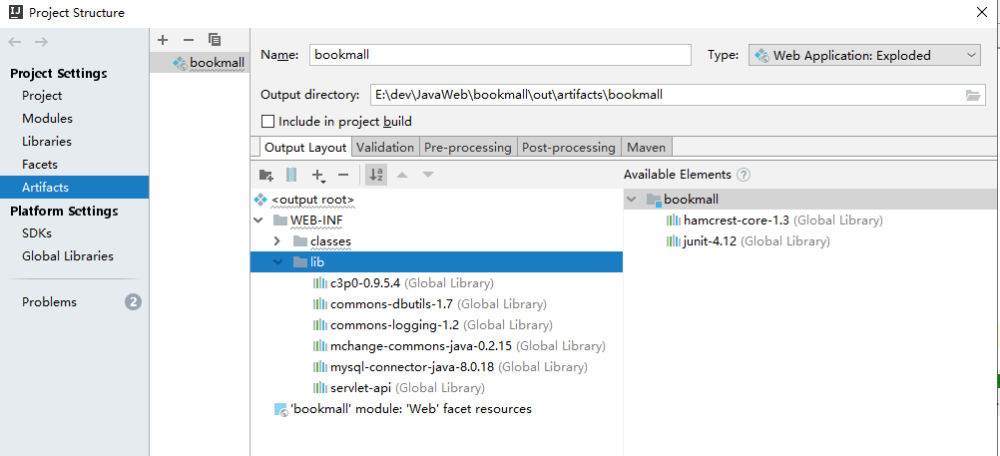

Book Mall
==

## jar导入
1. 使用添加jar包到Modules
    ```text
    先是添加Global Libraries，在从Global Libraries添加到
    需要的Modules。
    ```
2. 把Modules中的包添加到WEB-INF/lib
    ```text
    dbutils使用上述的方法导入后，在访问web时，包下列错误：
    java.lang.ClassNotFoundException: org.apache.commons.dbutils.ResultSetHandler
    ```
    

    **处理方法**
    ```text
    Project Structure -> Artifacts
    右键 commons-dbutils-1.7，点击 Put into/WEB-INF/lib，
    点击应用，重启tomcat即可
    ```
      
    
    
