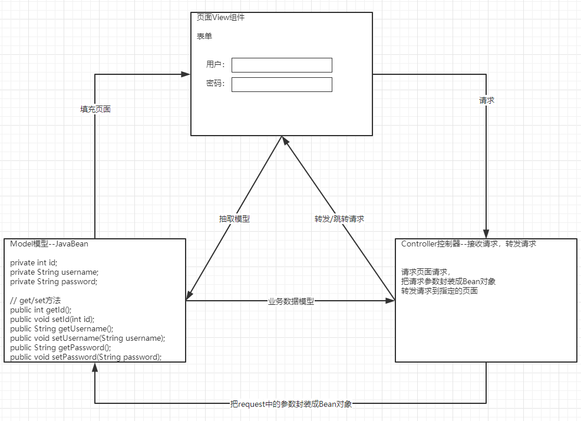

bookmall v5
==

## 模块拆分
* 图书模块增、删、改、查

    * BookDao接口
    ```text
    savebook  保存指定的图书
    deleteById  删除指定ID的图书
    updateBook  修改图书
    queryAllBooks  查询所有图书
    queryBookById  查询指定ID的图书
    ```

* 图书模块的分页搜索
* 图书首页的显示和按价格条件搜索
* 把分页导航条抽取成一个单独的jsp模块

## MVC概念
```text
M: Model模型
V: View视图
C: Controller控制器

MVC最早出现在JavaEE三层中的WEB层(DAO层、Service层、WEB层)，
它可以指导WEB层代码如何分离
```

* View视图
    >只负责数据和界面的显示，不接受任何与显示数据无关的代码，便于程序员和美工的分工合作--jsp \ html

* Controller控制器
    >只负责接收请求，调用业务层的业务逻辑代码处理请求，然后转发请求到指定的jsp页面，是一个"调度者"角色--Servlet

* Model模型
    >将业务逻辑相关的数据封装为具体的JavaBean类，其中不掺杂任何与数据处理相关的代码--JavaBean (有些取名domain\entity)

MVC是一种思想，MVC的理念是将软件 代码拆分成组件、单独开发、组合使用，目的是是为了解耦合



## 图书模块实现步骤
1. 创建图书模块的数据库
2. 编写图书的JavaBean--Book类
3. 创建图书模块的BookDao和实现类BookDaoImpl
4. 编写BookDao测试用例
5. 编写图书模块的BookService和实现类BookServiceImpl
6. 编写BookServlet类，实现如下功能
    * 列表查询所有图书功能
    * 图书的增加功能
    * 图书的删除功能
    * 图书的修改功能
7. 图书分页器
8. 首页index.jsp页面的访问
    >先经过Servlet获取要显示的数据，再转发到index.jsp显示数据
9. 实现首页图书按价格条件搜索并展示的功能

### 创建图书数据库表

