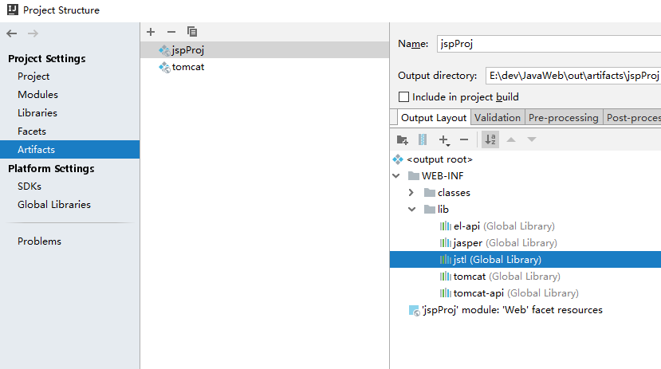

EL表达式 和 JSTL标签库
==

## EL表达式
### 什么是EL表达式
```text
EL：Expression Language，表达式语言。
可以输出表达式的值。跟jsp的表达式脚本一样，计算表达式的值后输出。

EL表达式出现的目的是为了使JSP写起来更加简单，让jsp的代码更简化。
主要用于替换 jsp 中表达式脚本
EL表达式的最主要功能就是从域对象中获取数据，并且输出
```
[初识EL表达式](../jspProj/web/el/el1.jsp)

### EL表达式获取域对象属性值
语法
```text
${属性名}

查找优先顺序(从作用范围小的到大的)：pageContext -> request -> session -> application
与书写顺序无关，
找到则返回相应数据、找不到则返回空串。（注意，不是null，而是空字符串）
```
[EL表达式获取域属性顺序](../jspProj/web/el/el2.jsp)

### 获取javaBean普通属性、数组属性、List集合属性，以map属性中的数据
[EL表达式获取对象属性值](../jspProj/web/el/el3.jsp)

### EL表达式_运算
语法：
```text
${运算表达式}
```

* 关系运算

    关系运算符| 说明 |示例 |结果  
    :--- |:--- |:--- |:---
    == 或 eq |= |${5 == 5} 或 ${5 eq 5}|true 
    != 或 ne |!= |${ 5 != 5} 或 ${5 ne 5} |false 
    < 或 lt |< |${3 < 5} 或 ${3 lt 5} |true 
    <= 或 le |<= |${5 <= 12} 或 ${5 le 12}|true 
    >= 或 ge |>= |${3 >= 5} 或 ${3 ge 5} |false 
    
    [示例](../jspProj/web/el/el4.jsp)

* 逻辑运算

    逻辑运算符| 说明 |示例 |结果  
    :--- |:--- |:--- |:---
    && 或 and |短路与 |${12 == 12 && 1 < 4} 或 ${12 == 12 and 1 < 4} |true 
    &#124;&#124; 或 or |短路或 |${12 != 12 &#124;&#124; 1 < 4} 或 ${12 != 12 or 1 < 4} |false 
    ! 或 not |非，取反运算 |${!false} 或 ${not false} |true 
    
    [示例](../jspProj/web/el/el5.jsp)


* 算术运算

    逻辑运算符| 说明 |示例 |结果  
    :--- |:--- |:--- |:---
    + |+ |12 + 18 = ${12 + 18} |12 + 18 = 30
    - |- |18 - 6 = ${18 - 6} |18 - 6 = 12 
    * |x |10 * 2 = ${10 * 2} |10 * 2 = 20 
    / 或 div |÷ |100 / 10 = ${100 / 10} |100 / 10 = 10 
    % 或 mod |取模 |100 % 33 = ${100 % 33} |100 % 33 = 1 
    
    [示例](../jspProj/web/el/el6.jsp)
    
* empty运算符
    ```text
    empty运算是判断一个对象或者集合是否为空，为空返回true。返回boolean值
    
    
    对象为null时，返回true
    
    如果是空的字符串，返回true
    
    如果是空的Object数组(Object数组.length == 0)，返回true
    
    空的集合，返回true
    
    空的map，返回true
    ```
    
    [示例](../jspProj/web/el/el7.jsp)
     
* 三元运算  
    语法：
    ```text
    ${表达式1 ? 表达式2 : 表达式3}
    ```
    如 ${10 == 10 ? "10等于10" : "10不等于10"}
    
    [示例](../jspProj/web/el/el8.jsp)
    
* "."点和[]中括号运算符
    ```text
    "." 运算符，可以获取JavaBean对象的属性值，可以可以取map对象的key
    
    [] 运算符，可以获取顺序集合中指定索引的元素，也可以获取特殊key的值，
        如比如key中含有 ".", "+", "_", "*", "/" 等的运算字符
    ```
    [示例](../jspProj/web/el/el9.jsp)

### EL表达式中11个隐含对象
以下这些对象可以直接使用

对象 |类型 |说明 
:--- |:--- |:--- 
pageContext |javax.servlet.jsp.PageContext |JSP页面中的pageContext对象 
pageScope |java.util.Map<String,Object> |page域对象的属性名和属性 
requestScope |java.util.Map<String,Object> |request域对象的属性名和属性值 
sessionScope |java.util.Map<String,Object> |session范围属性名和属性值 
applicationScope |java.util.Map<String,Object> |web应用范围属性名和属性值 
param |java.util.Map<String,String> |对应一个请求参数 
paramValues |java.util.Map<String,String[]> |对应一组请求参数 
header |java.util.Map<String,String> |请求头 
headerValues |java.util.Map<String,String[]> |请求头返回字符数组 
cookie |java.util.Map<String, Cookie> |获取某个cookie对象 
initParam |java.util.Map<String, String> |获取web.xml中<context-param>初始化参数 

* EL表达式获取指定域对象中的数据
    ```text
    当多个域对象设置了同名属性名的值时，获取顺序
    pageScope -> requestScope -> sessionScope -> applicationScope
    ```
    [示例](../jspProj/web/el/el10.jsp)

* 通过pageContext访问Jsp中内置对象
    ```text
    如：
        request对象，
        session对象，
        Servletconfig对象，
        ServletContext对象，
    
    
    常用获取下列属性值
    ==============
    
    协议：${pageContext.request.scheme}
    
    服务器IP：${pageContext.request.serverName}
    
    服务器port：${pageContext.request.serverPort}
    
    <%-- 工程path是以 /开头--%>
    工程path：${pageContext.request.contextPath}
    
    客户请求的方法：${pageContext.request.method}
    
    客户端ip address：${pageContext.request.remoteHost}
    
    session id：${pageContext.session.id}
    ```
    [示例](../jspProj/web/el/el11.jsp)
    
    [param、paramValues、header、headerValues、cookie、initParam 示例](../jspProj/web/el/el11.jsp)

   

## JSTL标签库
```text
JSTL：JSP Standard Tag Library，即JSP标准标签库。

是一个不断完善的开放源代码的JSP标签库。
EL表达式主要是为了替换jsp中的表达式脚本，
而标签库则是为了替换代码脚本。这样使得整个jsp页面变得更佳简洁。
```

### JSTL的标签库
* core核心库
    ><%@ taglib prefix="c" uri="http://java.sun.com/jsp/jstl/core" %> 
* 函数
    ><%@ taglib prefix="fn" uri="http://java.sun.com/jsp/jstl/functions" %>
* 格式化
    ><%@ taglib prefix="fmt" uri="http://java.sun.com/jsp/jstl/fmt" %>
* 数据库(不使用)
    ><%@ taglib prefix="sql" uri="http://java.sun.com/jsp/jstl/sql" %>
* xml(不使用)
    ><%@ taglib prefix="x" uri="http://java.sun.com/jsp/jstl/xml" %>

### 使用步骤
1. 导入taglib库
    ```text
    依赖 taglibs lib库
    官网：http://archive.apache.org/dist/tomcat/taglibs/
    
    jar包：
    taglibs-standard-impl-1.2.5.jar
    taglibs-standard-spec-1.2.5.jar
    taglibs-standard-compat-1.2.5.jar
    ```
      

2. 在使用的jsp页面中使用taglib指令导入需要的标签库
    ```text
    <%@ taglib prefix="tagPrefix" uri="http://java.sun.com/jsp/jstl/core" %>
    或
    <%@ taglib prefix="tagPrefix" tagDir="tagDir" %>
    
    属性含义
    ======
        prefix: 标签的前缀，区分多个自定义标签。不可以使用保留前缀和空前缀，遵循XML命名空间的命名约定。
            相当于库的唯一标识，因为JSTL由多个不同的库组成，使用该属性指定要导入哪个库
        uri: 定位标签库描述符的位置。唯一标识和前缀相关的标签库描述符，可以使用绝对或相对URL。
        tagDir: 指示前缀将被用于标识在WEV-INF/tags目录下的标签文件。可解压jar文件，查看.tld文件
    
    
    https://downloads.apache.org/tomcat/taglibs/taglibs-standard-1.2.5/README_bin.txt
    
    CORE LIBRARY
    <%@ taglib prefix="c" uri="http://java.sun.com/jsp/jstl/core" %>
 
    FUNCTIONS LIBRARY
    <%@ taglib prefix="fn" uri="http://java.sun.com/jsp/jstl/functions" %>
    
    FMT LIBRARY 
    <%@ taglib prefix="fmt" uri="http://java.sun.com/jsp/jstl/fmt" %>
    
    XML LIBRARY
    <%@ taglib prefix="x" uri="http://java.sun.com/jsp/jstl/xml" %>
    
    SQL LIBRARY
    <%@ taglib prefix="sql" uri="http://java.sun.com/jsp/jstl/sql" %>
    ```
    
### core核心库
```text
需要引入核心库

<%@ taglib prefix="c" uri="http://java.sun.com/jsp/jstl/core" %>
```

* \<c:out>标签
    ```text
    直接输出一个表达式的结果到html页面，
    与<%= 变量名 %> 作用相同
    ```
    
    **属性**
    
    属性 |说明 |是否写 |默认值 
    :--- |:--- |:--- |:--- 
    value |输出的内容，可以是EL表达式 |是 |无 
    default |当value为null时显示的默认值 |否 |空，相当于"" 
    escapeXml |是否对特殊字符进行转义，相当于对html代码进行解析 |否 |true 
    
    [\<c:out>](../jspProj/web/jstl/c/out.jsp)

* \<c:set>标签
    ```text
    用于 添加 或 修改 域中的属性
    ```
    **属性**
    
    属性 |说明 |是否写 |默认值 
    :--- |:--- |:--- |:--- 
    var |存储信息的变量 |否 |无 
    value |要存储或修改后的值 |否 |主体的内容 
    target |要修改的属性所属的对象，用于集合对象，即域对象的属性 |否 |无 
    property |集合对象中的key |否 |无 
    scope |var属性的作用域 (page, request, session, application) |无 |page 
    
    一般：
    * 操作域对象属性：target、property、value结合  
    * 操作一个域对象属性集合对象里的key-value：scope、var、value结合

    [\<c:set>](../jspProj/web/jstl/c/set.jsp)
* \<c:remove>标签
    ```text
    从域对象中移除一个属性
    ```
    **属性**
    
    属性 |说明 |是否写 |默认值 
    :--- |:--- |:--- |:--- 
    var |要移除的变量名 |是 |无 
    scope |作用域 |否 |所有作用域 
    
    [\<c:remove>](../jspProj/web/jstl/c/remove.jsp)

* \<c:if>标签
    ```text
    判断表达式的值，如果表达式的值为 true 则显示其标签内(HTML代码，会解析显示)
    ```
    **属性**
    
    属性 |说明 |是否写 |默认值 
    :--- |:--- |:--- |:--- 
    test |条件表达式 |是 |无
    var |用于存储test测试表达式的结果 |否 |无  
    scope |var属性的作用域 |否 |page  
    
    [\<c:if>](../jspProj/web/jstl/c/if.jsp)
    
* \<c:choose>、\<c:when>...、\<c:otherwise>标签
    ```text
    与Java switch语句的功能一样，值分支判断
  
    switch <--> <c:choose>
    case <--> <c:when>
    default <--> <c:otherwise>
    
    属性
    ===
    
        <c:choose> 标签没有属性。
        <c:when> 标签只有一个属性，test
        <c:otherwise> 标签没有属性。
    ```
    语法
    ```jsp
    <c:choose>
        <c:when test="${条件表达式1}">
            <div>显示情况1</div>
        </c:when>
        <c:when test="${条件表达式2}">
            <div>显示情况2</div>
        </c:when>
        ... ...
        <c:otherwise>
            <div>显示其他情况</div>
        </c:otherwise>
    </c:choose>
    ```
    
    \<c:when>标签的属性

    属性 |说明 |是否写 |默认值 
    :--- |:--- |:--- |:--- 
    test |条件表达式 |是 |无 
    
    [choose](../jspProj/web/jstl/c/choose.jsp)
    
* \<c:forEach>标签
    ```text
    迭代一个集合中的对象，可以是数组，也可以是list，也可以是map对象
    ```
    **属性**
    
    属性 |说明 |是否写 |默认值 
    :--- |:--- |:--- |:--- 
    var |定义接收被遍历的对象集合元素的变量，是一个value |否 |无 
    items |要被遍历的对象(集合)，可以是el表达式 |否 |无 
    begin |开始的索引 |否 |0 
    end |最后一个索引 |否 |Last 
    step |每次迭代的步长 |否 |1 
    varStatus |定义保存循环状态的变量名 |否 |无 
    
    ```text
    获取对象的长度
    ${fn:length(obj)}
    ```
    
    varStatus状态值：
    * begin 获取begin属性里的值 
    * end 获取end属性里的值
    * count 获取当前已遍历的个数
    * index 获取当前index的值
    * first 判断当前遍历的元素是否为第一个元素
    * last 判断当前遍历的元素是否为最后一个元素
    * current 获取当前遍历的元素对象，同var定义的变量
    
    [\<c:foreach>示例](../jspProj/web/jstl/c/foreach.jsp)

* \<c:url>标签
    ```text
    主要是用来生成一个url地址，添加到一个域属性中。还可以在生成地址的同时添加请求参数。
    如果请求的参数中带有中文，还会自动的做编码的操作
    ```
    **属性**
    
    属性 |说明 |是否写 |默认值 
    :--- |:--- |:--- |:--- 
    value |资源路径 |是 |无
    context |工程路径，上下文路径 |否 |当前易用所在工程路径
    var|保存URL的变量 |否 |直接输出
    scope|var属性的域作用范围，page,request,session,application |否 |page
    
    **url子标签\<c:param>，设置参数** 
    ```jsp
    <c:param name="key" value="值"></c:param>
    <%-- 一行设置一个参数，可以添加多行 --%> 
    ```
    
    [\<c:url>示例](../jspProj/web/jstl/c/url.jsp)
    
    **特别注意：相对路径不能修改context工程路径**  
    * 生成URL直接输出到页面，只能有context、value属性
        ><c:url value="" context=""/>
    * 使用相对路径生成URL，相对于当前工程path
        ```jsp
        <c:url var="url3" value="/a.jsp" scope="page">
            <c:param name="id" value="10101"></c:param>
            <c:param name="data" value="QQ"></c:param>
        </c:url>
        ```
    * 使用绝对路径生成URL
        ```jsp
        <c:url var="li" context="/list" value="/list.jsp" scope="request">
            <c:param name="type" value="all"></c:param>
            <c:param name="isCurrent" value="true"></c:param>
        </c:url>
        ```
    
* \<c:redirect>标签
    ```text
    重写URL来将浏览器重定向至一个新的URL，它提供内容相关的URL，支持<c:param>标签
    ```
    **属性**
        
    属性 |说明 |是否写 |默认值 
    :--- |:--- |:--- |:--- 
    url |目标URL |是 |无
    context |工程名path |否 |当前应用程序(当前工程path)
    
### fn函数库
```text
基本都是对字符串的操作，函数功能
需要引入函数库

<%@ taglib prefix="fn" uri="http://java.sun.com/jsp/jstl/functions" %>
```

* fn:contains函数 和 fn:containsIgnoreCase函数
    ```text
    用于判断字符串中是否包含指定字符串，
    containsIgnoreCase 忽略大小写
    ```
    语法
    ```text
    fn:contains(string, subString)
    
    string: 源字符串
    subString: 要查找的字符串
    return: Boolean值
        true: string中包含subString字符串
        false: 与true相反
    ```
    [contains_containsIgnoreCase 示例](../jspProj/web/jstl/fn/contains_containsIgnoreCase.jsp)

* fn:startsWith函数 和 fn:endsWith函数
    ```text
    fn:startsWith: 判断一个字符串是否以指定字符串开头
    fn:endsWith函数: 判断一个字符串是否以指定字符串结尾
    ```
    语法
    ```text
    fn:startsWith(string, prefix)
    fn:endsWith(string, suffix)
    
    string: 源字符串
    prefix: 要查找的前缀
    suffix: 要查找的后缀字符串
    return: Boolean
        true: 是匹配
        false: 不匹配
    ```
    
    [startsWith_endsWith 示例](../jspProj/web/jstl/fn/startsWith_endsWith.jsp)
    
* fn:indexOf函数
    ```text
    在一个字符串中查找指定字符串，并返回第一个符合的字符串的第一个字符的索引
    ```
    语法
    ```text
    fn:indexOf(string, subString)
    
    string: 源字符串
    subString: 要查找的字符串
    return: int
        若在string中找到subString则返回第一个符合的索引，
        若没有符合的则返回-1
    ```
    [indexOf 示例](../jspProj/web/jstl/fn/indexOf.jsp)
    
    
* fn:replace函数
    ```text
    将一个字符串替换为另外一个字符串，并返回替换后的字符串
    ```
    语法
    ```text
    fn:replace(str, beforeSubString, afterSubString)
    
    str: 源字符串
    beforeSubString: 被替换的字符串
    afterSubString: 要替换的新字符串,即afterSubString替换beforeSubString
    return: String
        替换后的字符串
    ```
    [replace 示例](../jspProj/web/jstl/fn/replace.jsp)
    
* fn:substring函数
    ```text
    截取字符串
    ```
    语法
    ```text
    fn:substring(str, beginIndex, endIndex)
    
    str: 源字符串
    beginIndex: int
        开始位置索引(包含该位置)
    endIndex: int
        结束位置索引(不包含自身)
    return: String
        返回截取的字符串
    ```
    [substring 示例](../jspProj/web/jstl/fn/substring.jsp)
    
    
* fn:substringBefore函数 和 fn:substringAfter函数
    ```text
    fn:substringBefore  返回一个字符串指定子串之前的字符串
    fn:substringAfter 返回一个字符串指定子串之后的字符串
    ```
    语法
    ```text
    fn:substringBefore(string,subString)
    fn:substringAfter(string,subString)
    
    string: 源字符串
    subString: 子字符串
    return: String
        返回一个字符串指定子串之前\之后的字符串
    ```

    [substringBefore_substringAfter 示例](../jspProj/web/jstl/fn/substringBefore_substringAfter.jsp)

* fn:split函数
    ```text
    将一个字符串拆分成字符串数组，并放回该字符串数组
    ```
    语法
    ```text
    fn:split(string, delimiters)
    
    string: 源字符串
    delimiters: 分隔符(字符串)
    return: String[]
    ```
    [split 示例](../jspProj/web/jstl/fn/split.jsp)

* fn:join函数
    ```text
    用指字符串将数据中的元素连接起来
    ```
    语法
    ```text
    fn:join(array, sparator)
    
    array: 字符串数组
    sparator: 连接字符
    return: String
    ```

    [join 示例](../jspProj/web/jstl/fn/join.jsp)

* fn:toLowerCase函数 和 fn:toUpperCase函数
    ```text
    fn:toLowerCase  将字符串都转换成大写字符，并返回
    fn:toUpperCase函数  将字符串都转换成小写字符，并返回
    ```
    语法
    ```text
    fn:toLowerCase(str)
    fn:toUpperCase(str)
    
    str: 源字符串
    return: String
        转换好后的字符串
    ```

    [toLowerCase_toUpperCase 示例](../jspProj/web/jstl/fn/toLowerCase_toUpperCase.jsp)

* fn:trim函数
    ```text
    去掉字符串的前后空格
    ```
    语法
    ```text
    fn:trim(str)
    
    str: 源字符串
    return: String
        去掉了字符串的前后空格后的字符串
    ```
    
    [trim 示例](../jspProj/web/jstl/fn/trim.jsp)

* fn:length函数
    ```text
    获取对象的长度
    ```
    语法
    ```text
    fn:length(obj)
    
    obj: 集合、字符串对象
    return: int
        对象的长度
    ```
    [length 示例](../jspProj/web/jstl/fn/length.jsp)
    
### fmt格式化库
