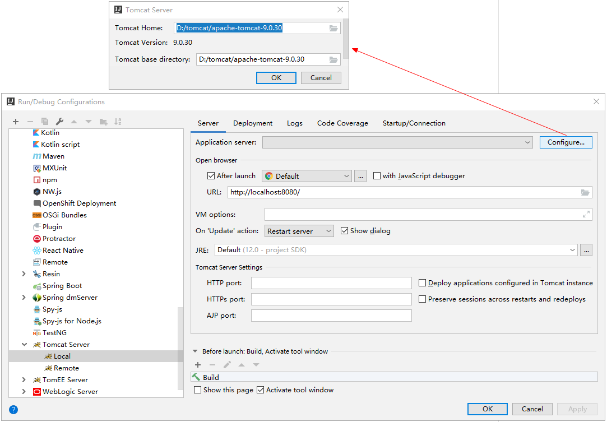

IDEA配置Tomcat、创建动态Web工程、新建一个Servlet项目
==


## IDEA配置Tomcat

1. 创建Java EE web项目


2. 配置tomcat server模板
    
      

    指定tomcat服务程序的根目录
    
    


## 创建动态Web工程
1. 创建Java EE项目
2. 将工程添加到tomcat服务器上
3. 添加tomcat server实例

      
     
    Application context：/工程名 
      
    确定 Project Structure ->Facets  
    Web Resource Directory为工程的web目录绝对路径
      
      
      
    
    若打开Facets页面，提示 Web' Facet resources are not included in an artifact，点击 Create Artifact 按钮即可
      
    
    
4. 运行tomcat
      
5. [乱码问题](IntelliJ_IDEA使用TOMCAT中文乱码.md)


## 导入jar包
这里以Junit包作为示例
另外可[参考](../bookmall/README.md)

1. 此时的web工程没有lib,创建lib文件夹

      
2. 添加jar包

        
    
    右击lib,选择Add as Library,点击OK  
      
    
    点击File–>Project Structure    
      
    
    点击Artifacts,此时WEB-INF下只有calsses,没有lib，**只有添加到Artifacts中的jar，才能在Tomcat中生效**  
       
    
    **右击WebProject下的lib,选择Put into/WEB-INF/lib**   
       
      
    

## 新建一个Servlet项目  
1. 创建Java EE web项目
2. 新建一个servlet文件：HelloWorld
      
      
3. 添加依赖的Tomcat下的Servlet库
      
      
      
4. 编写 HelloWorld.java 代码
```java

import java.io.IOException;
import java.io.PrintWriter;
import javax.servlet.*;
import javax.servlet.http.*;
 
 
public class HelloWorld extends HttpServlet {
 
    private String message;
 
    public void init() throws ServletException
    {
        // 初始化
        message = "Hello, First Servlet!";
    }
 
    protected void doPost(HttpServletRequest request, HttpServletResponse response) throws ServletException, IOException {
 
    }
 
    protected void doGet(HttpServletRequest request, HttpServletResponse response) throws ServletException, IOException {
        // 设置:响应内容类型
        response.setContentType("text/html");
 
        // 输出文本
        PrintWriter out = response.getWriter();
        out.write("<h1> " + message + " </h1>");
    }
}

```

5. 编写web.xml配置文件
```xml
<?xml version="1.0" encoding="UTF-8"?>
<web-app xmlns="http://xmlns.jcp.org/xml/ns/javaee"
         xmlns:xsi="http://www.w3.org/2001/XMLSchema-instance"
         xsi:schemaLocation="http://xmlns.jcp.org/xml/ns/javaee http://xmlns.jcp.org/xml/ns/javaee/web-app_4_0.xsd"
         version="4.0">
    <servlet>
        <servlet-name>HelloWorld</servlet-name>
<!--        全类名-->
        <servlet-class>HelloWorld</servlet-class>
    </servlet>
<!--    URL路由与servlet映射 -->
    <servlet-mapping>
        <servlet-name>HelloWorld</servlet-name>
        <url-pattern>/demo</url-pattern>
    </servlet-mapping>
</web-app>
```


6. 运行tomcat
      

7. 浏览器访问 http://localhost:8080/demo

8. web.xml配置的url与servlet映射不生效问题
    1. 先检测编译输出目录中是否存在有web.xml文件，如 out/artifacts/工程名/WEB-INF/web.xml
    2. 若步骤1中没有web.xml文件，则删除 out/artifacts/工程名 目录
    3. 重启tomcat
    
    
    
