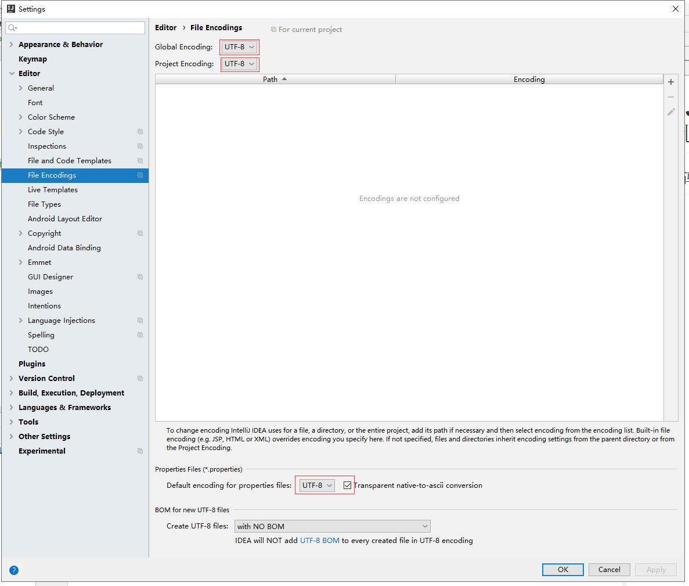

IntelliJ IDEA 使用 TOMCAT 中文乱码
==


## 运行tomcat时控制台乱码
1. idea.exe.vmoptions配置添加文件编码配置
    ```text
    打开idea根目录中的bin目录,在idea.exe.vmoptions、idea64.exe.vmoptions文件中添加下面这行
    
    -Dfile.encoding=UTF-8
    ```

2. 修改tomcat web服务的编码
    ```text
    Run/DeBug Configurations在VM options栏填写如下内容：
    
    -Dfile.encoding=UTF-8
    ```
    
    

3. 重启idea、Tomcat服务即可


## 工程乱码
打开File/Settings，修改如下几处




## 执行main函数时控制台乱码
```text
打开setting，找到 Build,Execution,Deployment > Compiler > Java Compiler， 
在Additional command line parameters栏填写如下参数
-encoding utf-8

然后rebuild下，重新运行
```


## jsp乱码
查看代码中是否添加下面代码
```text
<%@ page contentType="text/html;charset=UTF-8" language="java" pageEncoding="UTF-8" %>
```

## request和response乱码
在Servlet的doGet、doPost方法中设置字符集
```text
request.setCharacterEncoding("utf-8");

response.setContentType("text/html;charset=utf-8");
```
* 设置全局的request字符集
```text
直接在tomcat的安装包根目录/conf/server.xml中设置

<Connector port="8080" 
    protocol="HTTP/1.1"
    connectionTimeout="20000" 
    redirectPort="8443" URIEncoding="UTF-8" 
    />


```
