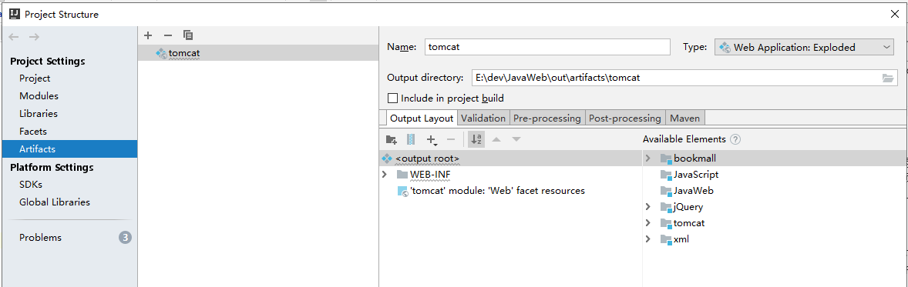
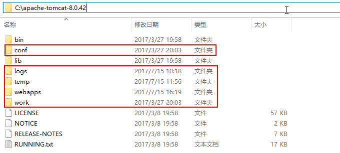
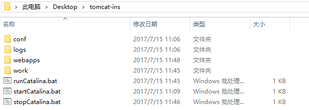

Intellij idea的tomcat原理
==


## tomcat常识
https://blog.csdn.net/leo3070/article/details/88062663
* tomcat需要JRE环境，JDK包含JRE
* 运行tomcat前需要配置一些系统环境变量
```
添加系统变量
CATALINA_HOME: D:\tomcat\apache-tomcat-9.0.30

系统变量PATH追加: %CATALINA_HOME%\bin

－－－－－－－－－－－－－－－－－－－－－－－－－－－－－－－－－－－－－－－－－－－－－－－－－－－－－－－－－－－－－－ 
启动 tomcat 服务器,打开你的cmd，输入以下命令 
catalina run 　 　// 启动，在原窗口启动 
catalina start 　　// 启动，会打开一个新的dos窗口启动 
catalina stop　　 // 停止tomcat服务器
```

* 看看简短的启动信息，对于理解intellij的tomcat很关键
```
C:\Users\用户名>catalina start
Using CATALINA_BASE:   "D:\tomcat\apache-tomcat-9.0.30"
Using CATALINA_HOME:   "D:\tomcat\apache-tomcat-9.0.30"
Using CATALINA_TMPDIR: "D:\tomcat\apache-tomcat-9.0.30\temp"
Using JRE_HOME:        "D:\java\jdk-12.0.1"
Using CLASSPATH:       "D:\tomcat\apache-tomcat-9.0.30\bin\bootstrap.jar;D:\tomcat\apache-tomcat-9.0.30\bin\tomcat-juli.jar"
```

CATALINA_BASE与CATALINA_HOME的区别

官方解释
```text
Throughout the docs, you’ll notice there are numerous references to CATALINA_HOME. 
This represents the root of your Tomcat installation. When we say, “This information 
can be found in your CATALINA_HOME/README.txt file” we mean to look at the README.txt 
file at the root of your Tomcat install. Optionally, Tomcat may be configured for 
multiple instances by defining CATALINA_BASE for each instance. If multiple instances 
are not configured, CATALINA_BASE is the same as CATALINA_HOME.
```

CATALINA_HOME是Tomcat的安装目录，CATALINA_BASE是Tomcat的工作目录。工作目录可以配置多个，即多个工程共享一个Tomcat的安装的安装程序

## Intellij idea的基于我们给tomcat创建了新的实例
```text
在Intellij中我们给web工程部署到tomcat服务器的时候，我们会有几个疑惑？ 
1. 为什么我们在tomcat的安装目录的webapps文件下找不到我们的工程 ? 
2. 为什么我们明明在tomcat安装目录下的conf/server.xml中配置了虚拟目录，部署项目后仍然找不到路径。(文件上传的时候需要配置虚拟目录接收上传的文件，否则浏览器是无法访问我们上传的文件如图片等) 在intellij中应当如何配置虚拟目录呢？两种方式，后面会说 

```

解决第一个问题
```text
一般来说，intellij 会默认将web工程的输出到本工程目录下为out目录中, 也有的是target目录中。
intellij idea使用Tomcat部署项目后并不会把编译后的项目复制到tomcat的webapps目录下,
但是它会把编译好的项目路径告诉Tomcat,让Tomcat来找到这个项目,
其它的项目比如Tomcat的主页项目ROOT是打不开的,
因为intellij idea 只让Tomcat运行了一个项目. 

每个Tomcat实例都有一个配置 工程名.xml文件，路径如下，在启动tomcat时，会显示具体的CATALINA_BASE，
C:\Users\用户名\.IntelliJIdea2019.1\system\Artifacts名\Tomcat_9_0_30_JavaWeb_2\conf\Catalina\localhost\工程名.xml
内容如下:

path值与配置的tomcat实例的工程访问URL是对应的
docBase值与配置的tomcat实例的Artifacts的Output directory值对应，
    告诉tomcat去哪里找编译后的项目，所以为什么tomcat实例的webapps目录下没有项目文件
```
```xml
<Context path="/tomcat" docBase="E:\dev\JavaWeb\out\artifacts\tomcat" />
```
path
  

docBase
  

第二个问题
```text
intellij idea中自己生成的tomcat实例存储路径如下:

C:\Users\登录本机的用户名\.IntelliJIdea2019.1\system\Artifacts名\tomcat版本_工程名_2
```
idea用的就是这下面的conf配置文件，运行tomcat时只会依赖装目录中的lib和bin两个文件夹  

这是idea集成的tomcat的启动日志
```text
Using CATALINA_BASE:   "C:\Users\cd\.IntelliJIdea2019.1\system\tomcat\Tomcat_9_0_30_JavaWeb_2"
Using CATALINA_HOME:   "D:\tomcat\apache-tomcat-9.0.30"
Using CATALINA_TMPDIR: "D:\tomcat\apache-tomcat-9.0.30\temp"
Using JRE_HOME:        "D:\java\jdk-12.0.1"
Using CLASSPATH:       "D:\tomcat\apache-tomcat-9.0.30\bin\bootstrap.jar;D:\tomcat\apache-tomcat-9.0.30\bin\tomcat-juli.jar"
```


## 为了更好的理解，自己动手配置一个tomcat实例
```text
首先在桌面上新建一个文件夹tomcat-ins，
然后从tomcat的安装目录中复制一些必要的文件到我们的文件夹，
因为lib和bin这两个文件夹内容是所有tomcat实例共享的，不需要复制
```
  

复制过来的文件稍微修改一下，清空一下webapps，log和work目录内容，并手动创建三个启动tomcat实例的批处理文件 
  


这些批处理文件内容如下
* runCatalina.bat
```bash
set "CATALINA_BASE=%cd%"
set "EXECUTABLE=%CATALINA_HOME%\bin\catalina.bat"
call "%EXECUTABLE%" run 
```

* startCatalina.bat
```bash
set "CATALINA_BASE=%cd%"
set "EXECUTABLE=%CATALINA_HOME%\bin\catalina.bat"
call "%EXECUTABLE%" start 
```

* stopCatalina.bat
```bash
set "CATALINA_BASE=%cd%"
set "EXECUTABLE=%CATALINA_HOME%\bin\catalina.bat"
call "%EXECUTABLE%" stop 
pause
```

Tip ：启动前在配置文件中修改一下相关的端口，这样多个tomcat启动就不会冲突


部署一个项目到我们的tomcat实例
在tomcat-ins/conf/Catalina/localhost文件夹下(如果没有该目录，手动新建)新建一个ROOT.xml文件
* 如果你想部署工程在跟目录下，url访问形同 http://localhost:8080/就可以可以直接访问index.jsp，修改ROOT.xml
```xml
<Context path="" docBase="E:\dev\JavaWeb\out\artifacts\tomcat" />
```

如果你想部署工程在dir1下，url访问形同 http://localhost:8080/dir1就可以直接访问index.jsp，修改ROOT.xml
```xml
<Context path="/dir1" docBase="E:\dev\JavaWeb\out\artifacts\tomcat" />
```

双击startCatalina.bat就可以启动我们建立的tomcat实例
