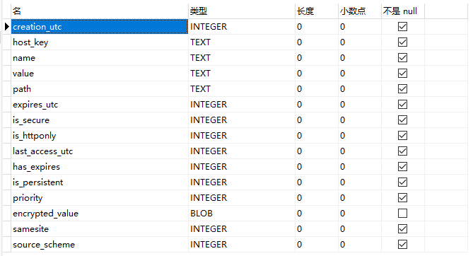

cookie和session
==

## cookie
### 什么是cookie
```text
Cookie，翻译是小饼的意思。它是一种服务器告诉浏览器以键值对形式存储小量信息的技术。

Cookie是一段不超过4KB的小型文本数据，由一个名称（Name）、一个值（Value）
和其它几个用于控制Cookie有效期、安全性、使用范围的可选属性组成。
```

* **cookie数据只保存在客户端(浏览器)，服务器不保存cookie数据**
* cookie值要求
    >对于0版cookies，值不能包含中文、空格、方括号、圆括号、等号、逗号、双引号、斜杠、问号、@符号、冒号和分号。空值在所有浏览器上的行为可能不同

* cookie在客户端本地是如何保存的，保存在哪
```text
使用一个SQLite数据库文件保存cookie，可以使用Navicat Premium等工具打开

Cookies SQLite库的结构
库：main
    表:cookies、meta
```

* chrome浏览器保存cookie文件路径
    ```text
    * Chrome浏览器
    %LOCALAPPDATA%\Google\Chrome\User Data\Default\ 目录中名为 Cookies 的文件
    
    * Firefox浏览器 
    Cookie 数据位于 %APPDATA%\Mozilla\Firefox\Profiles\ 目录中的 xxx.default 目录下，名为 Cookies.sqlite 的文件中
    
    * IE 浏览器
    %APPDATA%\Microsoft\Windows\Cookies\ 目录中的 xxx.txt 文件，里面可能有很多个. txt Cookie 文件
    ```
* Chrome浏览器查看cookies
    >设置 /隐私设置和安全性 /隐私设置和安全性 /Cookie 和网站数据 /所有 Cookie 和网站数据
    
    控制台查看cookie
      
    
    查看所有cookie
      
    
      
  
* cookies表
      
    
    创建cookies表sql
    ```sql
    PRAGMA foreign_keys = OFF;
    
    DROP TABLE
    IF EXISTS "main"."cookies";
    
    CREATE TABLE cookies (
        creation_utc INTEGER NOT NULL,
        host_key TEXT NOT NULL,
        name TEXT NOT NULL,
        value TEXT NOT NULL,
        path TEXT NOT NULL,
        expires_utc INTEGER NOT NULL,
        is_secure INTEGER NOT NULL,
        is_httponly INTEGER NOT NULL,
        last_access_utc INTEGER NOT NULL,
        has_expires INTEGER NOT NULL DEFAULT 1,
        is_persistent INTEGER NOT NULL DEFAULT 1,
        priority INTEGER NOT NULL DEFAULT 1,
        encrypted_value BLOB DEFAULT '',
        samesite INTEGER NOT NULL DEFAULT - 1,
        source_scheme INTEGER NOT NULL DEFAULT 0,
        UNIQUE (host_key, name, path)
    );
    ```

* meta表
      

    创建meta表sql
    ```sql
    DROP TABLE
    IF EXISTS "main"."meta";
    
    CREATE TABLE meta (
        KEY LONGVARCHAR NOT NULL UNIQUE PRIMARY KEY,
        value LONGVARCHAR
    );
    ```

* SQLite工具查看cookie
      


### 浏览器处理cookie机制
```text
浏览器有一个内存级的cookie池，cookie对象的增删改查会在cookie池操作，
后台进程有机制会自动同步内存cookie池数据到cookie SQLite库的cookies表中，
一般cookies表中的数据后滞后

概括：
===

* 内存cookie池负责cookie的增、删、改、查

* cookie SQLite库的cookies表负责cookie的持久化

* 浏览器在启动时会加载所有的cookie，并删除过期的cookie

* 浏览器在正常关闭的情况下，会把内存cookie池的数据同步到cookies表

```

* 客户端向服务器发送cookie信息
    ```text
    当客户端(浏览器)向浏览器发起请求时，会从本地的cookie SQLite数据库中检测有没有 host_key、path配置且没有过期的cookie，
    如果有，在request header中添加cookie信息， 格式 
    Cookie: cookie1名=cookie1值; cookie2名=cookie2值
    ```

* 客户端接收服务端发来的cookie信息
    ```text
    客户端(浏览器)接收服务端响应时，当response header中包含Set-Cookie属性字段时，
    （一个Set-Cookie只包含一个cookie对象的信息，一个cookie的多个属性数据之间用;分隔，至少包含name、value数据
    要传递多个cookie对象时，response header添加多个Set-Cookie，一行一个）
    这时浏览器会把Set-Cookie属性的值解析为一个cookie对象，
    以host_key, name, path组合为唯一约束
    
    * 当expires无数据时，则expires_utc=0，has_expires=0，表示为session会话级别，也就是关闭浏览器后，该cookie失效，在下次开启浏览器时删除
    
    * 当expires值<当前时间，立刻删除内存cookie池中该cookie，稍后cookies表中的数据也会删除
    
    * 当expires值>当前时间，若为新cookie，内存cookie池中添加该cookie，稍后cookies表中插入该cookie信息
        如果内存cookie池已经存在该cookie，则更新该cookie信息
    * 当无domain属性时，则默认为当前访问的域名，对应cookies表中的host_key字段
    * 当无path属性时，则默认为当前访问的路径，对应cookies表中的path字段
  
    服务端通知客户端增、删、改cookie格式：
    增、删、改动作由expires值和内存cookie池的数据情况决定
    
    Set-Cookie: username=zhaoliu; Max-Age=1800; Expires=Tue, 31-Mar-2020 15:14:49 GMT
    Set-Cookie: user_session=a75zXpUwH35bsDtWsmQn0itm8o6xOkWzkDsc1B4TU7F-J61p; path=/; expires=Tue, 14 Apr 2020 14:45:44 GMT; secure; HttpOnly
    ```

### 创建cookie
1. 新建Servlet，编写创建cookie代码
2. 客户端打开浏览器访问Servlet程序
3. 浏览器上打开F12打开开发者工具

[创建cookie代码示例 createCookie](../CookieSession/src/com/java/web/CookieServlet.java)

* 创建cookie过程
      

创建cookie测试示例
1. 浏览器首次访问，无cookie信息
      
      
2. 点击创建cookie，访问Servlet 创建cookie URL
      
      

3. 再次访问时，request header中已经携带了cookie信息
      

### 获取cookie
1. Servlet程序中编写获取cookie代码
2. 浏览器访问或获取cookie代码Servlet的URL

[服务端获取指定cookie示例 getCookie](../CookieSession/src/com/java/web/CookieServlet.java)

* 获取cookie过程
      

### 修过cookie值
1. Servlet中编写修改cookie代码
2. 浏览器访问修改cookie值的URL

[服务端获取指定cookie示例 updateCookie](../CookieSession/src/com/java/web/CookieServlet.java)

* 获取cookie过程
      

### cookie生命周期控制
```text
cookie对象的 setMaxAge(int expiry) 方法可以设置cookie对象的存活时间，单位为秒

expiry > 0: 表示从现在起，多少秒后过期

expiry = 0: 表示立刻删除该cookie

expiry < 0: 表示不保存该cookie，为session会话级cookie，即浏览器关闭后该cookie失效
```

* cookie生命周期控制过程
      

### 指定cookie的path
cookie对象的path，表示该cookie应用的path范围，是前缀匹配

* setPath(String uri)设置path
    ```text
    可以直接调用cookie对象该方法来设置path
    
    示例：
    一cookie对象，设置path: cookie.setPath("/day14/abc")
    
    客户端访问URL              服务端能否获取cookie情况
    ------------------------+---------------------
    /day14/abc                能获取Cookie
    /day14/xxxx.xxx           不能获取Cookie
    /day14/abc/xxx.xxx        能获取Cookie
    /day14/abc/a/b/c          能获取Cookie
    ```

### 利用cookie一段时间内免登录
* 一段时间内免登录示例  
    [jsp页面](../CookieSession/web/manager/user_home.jsp)  
    [Servlet：login \ logout](../CookieSession/src/com/java/web/LoginServlet.java)  
   


## 请求过程中的session操作
1. 首先要解析请求中的sessionId信息，然后将sessionId存储到request的参数列表中。

2. 然后再从 request获取session的时候，如果存在sessionId那么就根据Id从session池中获取session，如果sessionId不存在或者session失效，那么则新建session并且将session信息放入session池，供下次使用。


response headers
Set-Cookie: no=xs1001
当需要设置多个cookie时，就添加多条Set-Cookie: value


request headers
Cookie: no=xs1001

多个cookie值之间用;分隔


session最大不活动间隔时间(超时时间)


配置文件 conf/web.xml，这是对全局生效的

idea
${CATALINA_BASE}/conf/web.xml
```text
  <!-- ==================== Default Session Configuration ================= -->
  <!-- You can set the default session timeout (in minutes) for all newly   -->
  <!-- created sessions by modifying the value below.                       -->

    <session-config>
        <session-timeout>30</session-timeout>
    </session-config>
```


* response.encodeRedirectURL(String url)
```text
当客户端禁用了cookie时，向服务器上发起的request不包括jsessionid cookie时，会自动在你指定的URL的参数前插入 ;jsessionid=jsessionid值
如 sessionServlet;jsessionid=E1764F5AFB67A96A5B8F8EFD4700F673?action=createOrGetSession

当客户端服务器上发起的request包括jsessionid cookie时，response.encodeRedirectURL(url)方法返回的就是url，不做任何处理 
```

* <c:url value="sessionServlet?action=createOrGetSession" />同上


session纯化与活化

序列化文件
${CATALINA_BASE}/work/Catalina/localhost/项目名/SESSIONS.ser
C:\Users\cd\.IntelliJIdea2019.1\system\tomcat\Tomcat_9_0_30_(1)_JavaWeb_3\work\Catalina\localhost\cookieSession\SESSIONS.ser
