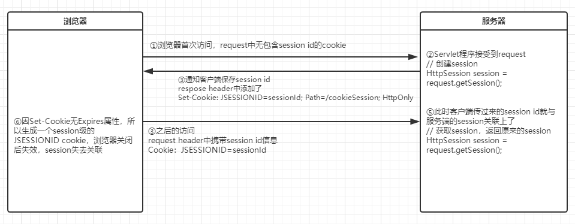
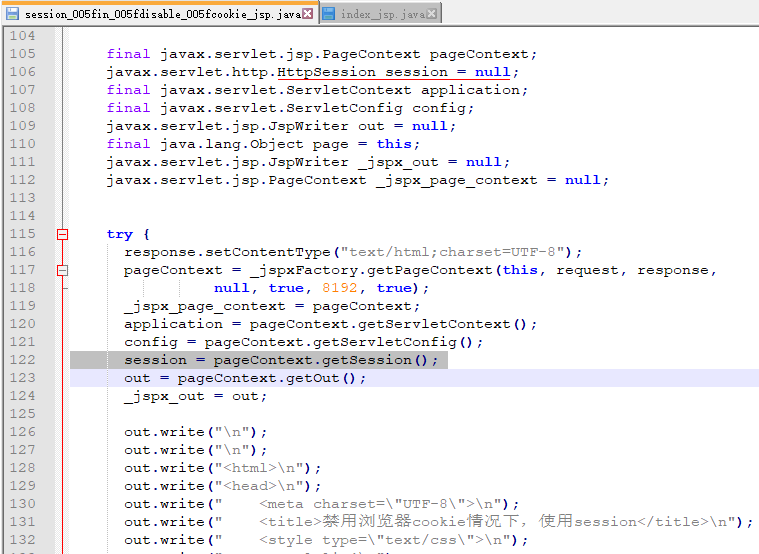

cookie和session
==

## cookie
* [cookie和session测试入口页面](../CookieSession/web/index.html)

### 什么是cookie
```text
Cookie，翻译是小饼的意思。它是一种服务器告诉浏览器以键值对形式存储小量信息的技术。

Cookie是一段不超过4KB的小型文本数据，由一个名称（Name）、一个值（Value）
和其它几个用于控制Cookie有效期、安全性、使用范围的可选属性组成。
```

* **cookie数据只保存在客户端(浏览器)，服务器不保存cookie数据**

* cookie值要求
```text
值为String型，不能包含中文、空格、方括号、圆括号、等号、逗号、双引号、斜杠、问号、@符号、冒号和分号。
空值在所有浏览器上的行为可能不同
一般包含字母、数字、-、_

如果是二进制值，需要转成BASE64编码，如把中文转成 BASE64编码的形式

With Version 0 cookies, values should not contain white 
space, 空格
brackets, 方括号
parentheses, 圆括号
equals signs, 等号
commas, 都好
double quotes, 双引号
slashes, 斜杠
question marks, 问好
at signs, @符号
colons, 冒号
and semicolons. 分号
Empty values may not behave the same way on all browsers.
```  

* cookie在客户端本地是如何保存的，保存在哪
```text
使用一个SQLite数据库文件保存cookie，可以使用Navicat Premium等工具打开

Cookies SQLite库的结构
库：main
    表:cookies、meta
```

* chrome浏览器保存cookie文件路径
    ```text
    * Chrome浏览器
    %LOCALAPPDATA%\Google\Chrome\User Data\Default\ 目录中名为 Cookies 的文件
    
    * Firefox浏览器 
    Cookie 数据位于 %APPDATA%\Mozilla\Firefox\Profiles\ 目录中的 xxx.default 目录下，名为 Cookies.sqlite 的文件中
    
    * IE 浏览器
    %APPDATA%\Microsoft\Windows\Cookies\ 目录中的 xxx.txt 文件，里面可能有很多个. txt Cookie 文件
    ```
* Chrome浏览器查看cookies
    >设置 /隐私设置和安全性 /隐私设置和安全性 /Cookie 和网站数据 /所有 Cookie 和网站数据
    
    控制台查看cookie
      
    
    查看所有cookie
      
    
      
  
* cookies表
      
    
    创建cookies表sql
    ```sql
    PRAGMA foreign_keys = OFF;
    
    DROP TABLE
    IF EXISTS "main"."cookies";
    
    CREATE TABLE cookies (
        creation_utc INTEGER NOT NULL,
        host_key TEXT NOT NULL,
        name TEXT NOT NULL,
        value TEXT NOT NULL,
        path TEXT NOT NULL,
        expires_utc INTEGER NOT NULL,
        is_secure INTEGER NOT NULL,
        is_httponly INTEGER NOT NULL,
        last_access_utc INTEGER NOT NULL,
        has_expires INTEGER NOT NULL DEFAULT 1,
        is_persistent INTEGER NOT NULL DEFAULT 1,
        priority INTEGER NOT NULL DEFAULT 1,
        encrypted_value BLOB DEFAULT '',
        samesite INTEGER NOT NULL DEFAULT - 1,
        source_scheme INTEGER NOT NULL DEFAULT 0,
        UNIQUE (host_key, name, path)
    );
    ```

* meta表
      

    创建meta表sql
    ```sql
    DROP TABLE
    IF EXISTS "main"."meta";
    
    CREATE TABLE meta (
        KEY LONGVARCHAR NOT NULL UNIQUE PRIMARY KEY,
        value LONGVARCHAR
    );
    ```

* SQLite工具查看cookie
      


### 浏览器处理cookie机制
```text
浏览器有一个内存级的cookie池，cookie对象的增删改查会在cookie池操作，
后台进程有机制会自动同步内存cookie池数据到cookie SQLite库的cookies表中，
一般cookies表中的数据后滞后

概括：
===

* 内存cookie池负责cookie的增、删、改、查

* cookie SQLite库的cookies表负责cookie的持久化

* 浏览器在启动时会加载所有的cookie，并删除过期的cookie

* 浏览器在正常关闭的情况下，会把内存cookie池的数据同步到cookies表

```

* 客户端向服务器发送cookie信息
    ```text
    当客户端(浏览器)向浏览器发起请求时，会从本地的cookie SQLite数据库中检测有没有 host_key、path配置且没有过期的cookie，
    如果有，在request header中添加cookie信息，多个cookie值之间用;分隔
    格式 
    Cookie: cookie1名=cookie1值; cookie2名=cookie2值
    ```

* 客户端接收服务端发来的cookie信息
    ```text
    客户端(浏览器)接收服务端响应时，当response header中包含Set-Cookie属性字段时，
    （一个Set-Cookie只包含一个cookie对象的信息，一个cookie的多个属性数据之间用;分隔，至少包含name、value数据
    要传递多个cookie对象时，response header添加多个Set-Cookie，一行一个）
    这时浏览器会把Set-Cookie属性的值解析为一个cookie对象，
    以host_key, name, path组合为唯一约束
    
    * 当expires无数据时，则expires_utc=0，has_expires=0，表示为session会话级别，也就是关闭浏览器后，该cookie失效，在下次开启浏览器时删除
    
    * 当expires值<当前时间，立刻删除内存cookie池中该cookie，稍后cookies表中的数据也会删除
    
    * 当expires值>当前时间，若为新cookie，内存cookie池中添加该cookie，稍后cookies表中插入该cookie信息
        如果内存cookie池已经存在该cookie，则更新该cookie信息
    * 当无domain属性时，则默认为当前访问的域名，对应cookies表中的host_key字段
    * 当无path属性时，则默认为当前访问的路径，对应cookies表中的path字段
  
    服务端通知客户端增、删、改cookie格式：
    增、删、改动作由expires值和内存cookie池的数据情况决定
    当需要设置多个cookie时，就添加多条Set-Cookie: value
    
    Set-Cookie: username=zhaoliu; Max-Age=1800; Expires=Tue, 31-Mar-2020 15:14:49 GMT
    Set-Cookie: user_session=a75zXpUwH35bsDtWsmQn0itm8o6xOkWzkDsc1B4TU7F-J61p; path=/; expires=Tue, 14 Apr 2020 14:45:44 GMT; secure; HttpOnly
    ```

### 创建cookie
1. 新建Servlet，编写创建cookie代码
2. 客户端打开浏览器访问Servlet程序
3. 浏览器上打开F12打开开发者工具

[创建cookie代码示例 createCookie](../CookieSession/src/com/java/web/CookieServlet.java)

* 创建cookie过程
      

创建cookie测试示例
1. 浏览器首次访问，无cookie信息
      
      
2. 点击创建cookie，访问Servlet 创建cookie URL
      
      

3. 再次访问时，request header中已经携带了cookie信息
      

### 获取cookie
1. Servlet程序中编写获取cookie代码
2. 浏览器访问或获取cookie代码Servlet的URL

[服务端获取指定cookie示例 getCookie](../CookieSession/src/com/java/web/CookieServlet.java)

* 获取cookie过程
      

### 修过cookie值
1. Servlet中编写修改cookie代码
2. 浏览器访问修改cookie值的URL

[服务端获取指定cookie示例 updateCookie](../CookieSession/src/com/java/web/CookieServlet.java)

* 获取cookie过程
      

### cookie生命周期控制
```text
cookie对象的 setMaxAge(int expiry) 方法可以设置cookie对象的存活时间，单位为秒

expiry > 0: 表示从现在起，多少秒后过期

expiry = 0: 表示立刻删除该cookie

expiry < 0: 表示不保存该cookie，为session会话级cookie，即浏览器关闭后该cookie失效
```

* cookie生命周期控制过程
      

### 指定cookie的path
cookie对象的path，表示该cookie应用的path范围，是前缀匹配

* setPath(String uri)设置path
    ```text
    可以直接调用cookie对象该方法来设置path
    
    示例：
    一cookie对象，设置path: cookie.setPath("/day14/abc")
    
    客户端访问URL              服务端能否获取cookie情况
    ------------------------+---------------------
    /day14/abc                能获取Cookie
    /day14/xxxx.xxx           不能获取Cookie
    /day14/abc/xxx.xxx        能获取Cookie
    /day14/abc/a/b/c          能获取Cookie
    ```

### 利用cookie一段时间内免登录
```text
原理：服务端判断request是否有指定name的cookie，
有则已经登录，没有则告诉客户端跳转到登录页面
登录逻辑：判断用户密码是否匹配，
如果匹配，则创建指定name的cookie，设置cookie的maxAge（即可多久有效）
并添加到response对象中，这样登录一次后，在一段时间内就可以免登录了
```

* 一段时间内免登录示例  
    [jsp页面](../CookieSession/web/manager/user_home.jsp)  
    [Servlet：login \ logout](../CookieSession/src/com/java/web/LoginServlet.java)  
   

## session
### 什么是session
```text
session即会话，服务器端用来保存用户数据的一种技术，并且Session会话技术是基于Cookie实现的。
Session对象存储特定用户会话所需的属性及配置信息。
Session是jsp中九大内置对象之一，session是一个域对象

服务端有一个session池，用于存取多个session对象，一个session对象包含了id和其他属性，重要的属性信息数据只保存在服务端
客户端(浏览器)用一个约定name的cookie来保存session的id值，一个session id就相当于一个令牌(门票)，客户端主要保存了session id信息。
    约定的cookie name有服务端指定，如Tomcat为JSESSIONID
服务端与客户端就是通过session的id来匹配关联

服务端session池保存在内存中，是用HashMap实现的
```

### 创建或获取session
```text
String getId()  获取session id
boolean isNew()  判断该sessin是否为新建的
```

* request.getSession()
    ```text
    从session池中返回与当前request中的session id关联的session对象，
    如果没有关联的session就新建一个session对象，并把该session id信息以cookie形式添加到response header返回给客户端
    格式：Set-Cookie: JSESSIONID=C02805F92A239A074DA3AE122BA4E232; Path=/cookieSession; HttpOnly 
    此cookie的未设置过期时间，默认为0，即session级cookie，关闭浏览器失效
  
    HttpSession session = request.getSession();
    ```
    
* 示例
    [创建或获取session Servlet：createOrGetSession](../CookieSession/src/com/java/web/SessionServlet.java)  
    
    访问http://localhost:8080/cookieSession/session.html，
    
    点击 session的创建和获取(id,是否为新创建)
      
    
    再次访问 session的创建和获取(id,是否为新创建)  
      
      

* 创建或获取session过程
      

#### 服务端创建或获取session过程
1. 从request解析session id信息（若有，则包含在request header中的Cookie字段中、或直接[携带在URL中](#浏览器禁用Cookie后如何关联session)）
2. 如果无session id信息
    >就新建session对象，放入session池，并把session id信息填在在resposne中，即添加Set-Cookie: JESSION=sessionId
3. 如果有session id信息
    >则根据id信息到session池中查找此session, 如果有且没有过期，则返回此session对象，否则新建session，步骤同2

### session域对象属性数据的添加与获取
```text
getAttribute(String name)  通过属性名获取值
setAttribute(String name, Object value)  设置属性、属性值，一般要求value可序列化，主要是为了session钝化保存时，可序列化保存
```

[设置session属性 Servlet：setSessionAttribute](../CookieSession/src/com/java/web/SessionServlet.java)  
[获取session属性 Servlet：getSessionAttribute](../CookieSession/src/com/java/web/SessionServlet.java)  

### session生命周期控制
```text
session的默认超时时间为30分钟，session的超时信息保存在服务端的session对象中
```
* session默认超时时间全局配置
    ```xml
    <!-- 配置文件：tomcat程序根路径的conf/web.xml -->
    <!-- ==================== Default Session Configuration ================= -->
    <!-- You can set the default session timeout (in minutes) for all newly   -->
    <!-- created sessions by modifying the value below.                       -->
    
    <session-config>
        <session-timeout>30</session-timeout>
    </session-config>
    ```
* session默认超时时间单个站点生效
    ```xml
    <!--
    配置文件：web/WEB-INF/web.xml
    在web-app块内添加下列配置
    -->
    
    <session-config>
        <!-- 单位：分 -->
        <session-timeout>30</session-timeout>
    </session-config>
    ```

* 控制session生命周期方法
    ```text
    getMaxInactiveInterval()  获取session对象的超时时间，单位为秒
    
    setMaxInactiveInterval(int interval)  设置sessio的超时时间（设置最大不活动间隔时间），单位为秒
        interval > 0: 表示interval秒后，此session失效
        interval <= 0: 表示此session永不超时
    
    invalidate()  立刻删除session，使该session对象马上失效，除所有绑定到它的属性对象。
        此变动是发生在服务端的，删除该session后，客户端上的保存session id的cookie还不会删除
        等到下次客户端把session id信息传到服务端获取session，已经无此id的session了，服务端会新建一个session，并通知客户端新session的id
    ```

[立刻删除session：invalidate](../CookieSession/src/com/java/web/SessionServlet.java) 
[设置session的超时时间：setMaxInactiveInterval](../CookieSession/src/com/java/web/SessionServlet.java) 

### session的钝化与活化
* session钝化
    ```text
    在tomcat正常关闭的情况下，把内存ession池中的所有session对象序列化到
    Tomcat程序目录/work/Catalina/localhost/工程名/SESSIONS.ser 的二进制文件，
    idea中：${CATALINA_BASE}/work/Catalina/localhost/项目名/SESSIONS.ser
    把内存中的session数据保存到文件

    若tomcat配置开启session持久化(默认是开启的)，则tomcat在正常停止时，会创建上面的SESSIONS.ser
    ```
* session活化
    ```text
    tomcat在启动时，从Tomcat程序目录/work/Catalina/localhost/工程名/SESSIONS.ser文件
    反序列化加载session数据到内存中，
    从文件中读取sesion数据到内存中

    tomcat在启动时，从SESSIONS.ser文件加载完数据后，会删除SESSIONS.ser文件
    ```

* session对象中的属性值可序列化问题
    ```text
    对session对象中的属性值若要能正常保存到文件并恢复，要求属性值是可序列化，
    否则session钝化时会丢失该属性值，活化时读取结果为null
    ```

### jsp中第一次访问Servlet获取的session为什么不是新的
```text
当我们去访问jsp页面，实际上是访问Servlet程序。而且在生成的Servlet程序中有9大内置对象，其中就有session。
jsp页面翻译的Servlet程序就已经创建了session对象。
之后我自建的Sevlet程序中request.getSession()方法获取到的Session对象即使jsp翻译的Servlet程序创建的
```

  


### 浏览器与服务器之间session关联的原理
```text
1. 浏览器向服务器发起请求，此时request中无session id信息，
2. 服务器上接收请求后，生成session，并把session id通过response header的Set-Cookie字段返回给客户端，
    Set-Cookie: JSESSIONID=sessionId
3. 默认情况下Set-Cookie未指定Expires，浏览器保存session id的cookie在浏览器关闭后失效
```
  
```text
当浏览器关闭之后，只是因为浏览器无法再通知服务器原来的session id，
所以服务器没办法找到对应的session对象之后，认为这是第一次访问服务器，于是创建新的session对象返回
```

### 让session在浏览器关闭后不失效
```text
若要浏览器关闭后，再次向服务器发起请求时，能关联上原来的session，
则需要让记录session id的cookie(JSESSIONID)在浏览器关闭后不失效。
这时就需要让记录session id的cookie在生成时就设置存活时间
```

* 让session在浏览器关闭后不失效
    
    ```java
        protected void getSessionAfterCloseBrowser(HttpServletRequest request, HttpServletResponse response) throws ServletException, IOException {
            HttpSession session = request.getSession();
            Cookie ck = new Cookie("JSESSIONID", session.getId());
            // 设置cookie的maxAge
            ck.setMaxAge(1800);
            response.addCookie(ck);
            response.getWriter().write("设置session超时时间为半小时，关闭浏览器后session仍可生效");
        }
    ```
    [设置记录session id的cookie的存活时间：getSessionAfterCloseBrowser](../CookieSession/src/com/java/web/SessionServlet.java) 
      
      


### 浏览器禁用Cookie后如何关联session
```text
修改JSESSIONID的Cookie的存活时间，在浏览器关闭之后，可以让session继续进行关联。
如果浏览器禁用了cookie，这时又怎么关联session呢？

有一种解决方案：session ID写到URL中，通过URL携带session id信息。
即服务器在生成的超链接中把session id放在URL中

在URL path后，参数前的位置，加入session id信息 ;jsessionid=sessionId
格式：
http://localhost:8080/cookieSession/sessionServlet;jsessionid=5ADCE3897BBE5A4EADA668869EC1A45F?action=createOrGetSession

Servlet程序会对request中的URL带;部分做处理，即从URI中解析requestSessionId
```

* response.encodeRedirectURL(String url)
    ```text
    当客户端禁用了cookie时，向服务器上发起的request不包括jsessionid cookie时，会自动在你指定的URL的参数前插入 ;jsessionid=jsessionid值
    如 sessionServlet;jsessionid=E1764F5AFB67A96A5B8F8EFD4700F673?action=createOrGetSession
    
    当客户端服务器上发起的request携带了jsessionid cookie时，response.encodeRedirectURL(url)方法返回的就是url，不做任何处理 
    ```

* \<c:url value="sessionServlet?action=createOrGetSession" />同上

[浏览器禁用Cookie后关联session，URI携带session id信息](../CookieSession/web/session_in_disable_cookie.jsp)  

  


### 利用session实现用户的登录、退出
[session实现用户的登录、退出示例](../CookieSession/web/secret_book/index.jsp)  