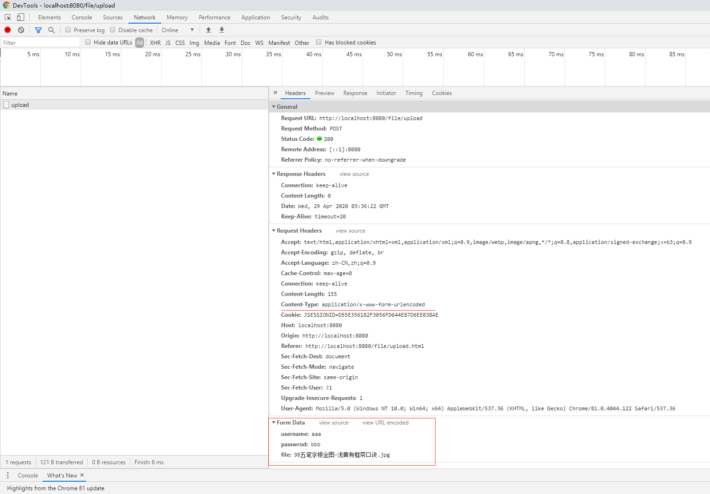
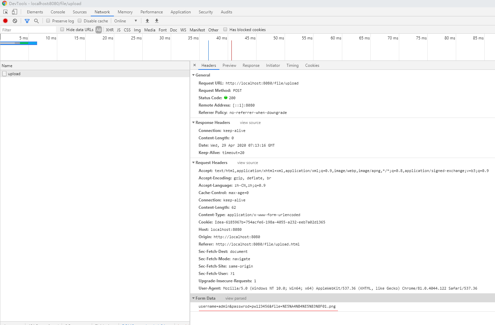
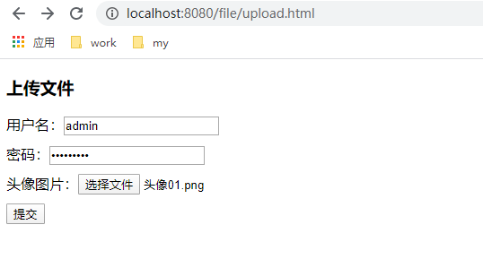
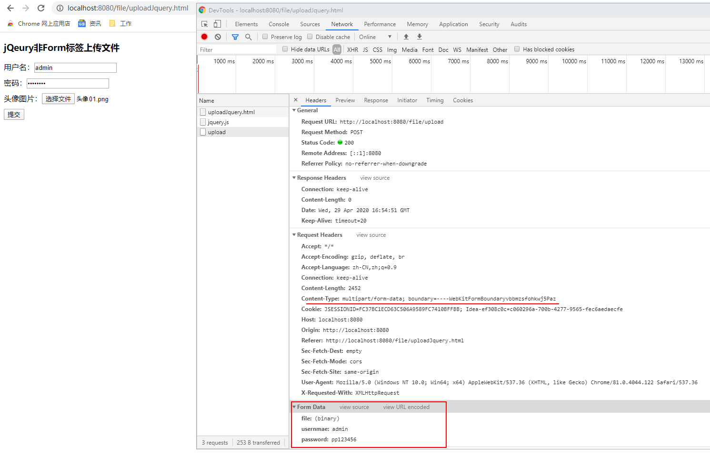

文件上传和下载
==

## 文件上传依赖jar包
* 依赖jar包
```text
commons-fileupload.jar
commons-io.jar

https://commons.apache.org/proper/commons-fileupload/
http://commons.apache.org/proper/commons-io/
```


## commons-fileupload接口介绍

* boolean ServletFileUpload.isMultipartContent(HttpServletRequest request)
    >判断请求是否为文件上传的enctype是否为multipart/form-data

* public List<FileItem> parseRequest(HttpServletRequest request)
    >解析request对象，获取请求参数，返回的是一个List，List中保存的是一个FileItem对象，一个对象代表一个请求表单项。
* boolean FileItem.isFormField()
    >判断当前表单项是否是普通表单项。如果是普通项。返回true,如果是文件上传项。返回false。enctype="application/x-www-form-urlencoded"，则是普通表单项
* String FileItem.getFieldName()
    >返回表单项的属性name的值
* String FileItem.getString()
    >返回表单项的值
* String FileItem.getName()
    >返回上传文件的文件名
* void FileItem.write(file)
    >把上传的文件输入到指定的file位置
* FileItemFactory 
    >我们使用的是DiskFileItemFactory，解析Request对象使用ServletFileUpload类实例的.parseRequest(HttpServletRequest request)方法


### FileUpload类库的使用
```text
1. Check that we have a file upload request，
    // 实现方法：判断request请求头的Content-Type字段值是否以“multipart/”开头
    boolean isMultipart = ServletFileUpload.isMultipartContent(request);

2. Create a factory for disk-based file items
    DiskFileItemFactory factory = new DiskFileItemFactory();

3. Create a new file upload handler
    ServletFileUpload upload = new ServletFileUpload(factory);

4. Parse the request
    List<FileItem> items = upload.parseRequest(request);

5. 遍历表单项，判断每个表单项。是否为上传文件。而做不同的相应的处理。
    for (FileItem fileItem : items) {
        // 普通表单项
        if (fileItem.isFormField()) {
        }
        // 文件
        else {
        }
    }
```

## 浏览器提交表单数据的格式
### form表单enctype="application/x-www-form-urlencoded"提交的数据格式
这种方式提交的文件，服务器是无法接收到的，只能接收到文件名
```text
POST / HTTP/1.1
Host: 127.0.0.1
Connection: keep-alive
Content-Length: 30443
Cache-Control: max-age=0
Upgrade-Insecure-Requests: 1
Origin: http://localhost:8080
Content-Type: application/x-www-form-urlencoded
User-Agent: Mozilla/5.0 (Windows NT 10.0; Win64; x64) AppleWebKit/537.36 (KHTML, like Gecko) Chrome/81.0.4044.122 Safari/537.36
Accept: text/html,application/xhtml+xml,application/xml;q=0.9,image/webp,image/apng,*/*;q=0.8,application/signed-exchange;v=b3;q=0.9
Sec-Fetch-Site: cross-site
Sec-Fetch-Mode: navigate
Sec-Fetch-User: ?1
Sec-Fetch-Dest: document
Referer: http://localhost:8080/file/upload.html
Accept-Encoding: gzip, deflate, br
Accept-Language: zh-CN,zh;q=0.9

username=admin&passwrod=pw123456&file=%E5%A4%B4%E5%83%8F01.png
```
  
  


### form表单enctype="multipart/form-data"提交的数据格式
enctype为多部件格式时，可上传文件

  
  

服务端接收到的数据
```text
POST / HTTP/1.1
Host: 127.0.0.1
Connection: keep-alive
Content-Length: 30443
Cache-Control: max-age=0
Upgrade-Insecure-Requests: 1
Origin: http://localhost:8080
Content-Type: multipart/form-data; boundary=----WebKitFormBoundaryjoEWO9I66SQ9rs0d
User-Agent: Mozilla/5.0 (Windows NT 10.0; Win64; x64) AppleWebKit/537.36 (KHTML, like Gecko) Chrome/81.0.4044.122 Safari/537.36
Accept: text/html,application/xhtml+xml,application/xml;q=0.9,image/webp,image/apng,*/*;q=0.8,application/signed-exchange;v=b3;q=0.9
Sec-Fetch-Site: cross-site
Sec-Fetch-Mode: navigate
Sec-Fetch-User: ?1
Sec-Fetch-Dest: document
Referer: http://localhost:8080/file/upload.html
Accept-Encoding: gzip, deflate, br
Accept-Language: zh-CN,zh;q=0.9

------WebKitFormBoundaryvbbmzsfohkwj5Paz
Content-Disposition: form-data; name="username"

admin
------WebKitFormBoundaryvbbmzsfohkwj5Paz
Content-Disposition: form-data; name="passwrod"

pw123456
------WebKitFormBoundaryvbbmzsfohkwj5Paz
Content-Disposition: form-data; name="file"; filename="头像01.png"
Content-Type: image/png

�PNG

   
IHDR   �      �    IDATx���g�l�q%�ǔm�}����#H���P$'F�B��!*�A�U�DMP#�H� �ó��mW]��Z�yή��H֍��]昽sg�\iv����/��r)�\�����?�������p*ggg�����>�GY.ruu#��Z���no���Z���L����XF��I����_��d����2}���Q��C988������`��}��Od��XoV2��d<ʣG���@����F��P~��_ȳ�Od2�������Ϟ^Ȳ�N&rvz*{{{<��Ņ<{���������e�^�5<�Zs��x�u�G��|��c"c��񰔁��H��(J���wʂǨk���O��k�׍��"US��Ҭ*Y��+�N�C�����^��^3^�ϲ,yO��W޿�i�x�F#~������Ҿ�_�t��T�nW��I�l�:�#O�RU)���f>����6WWr�O�~���	�˱����!ӛ����ܪ�
U8Fz\8��W_�'��{7������#ٟ�e2*�{+y�������J���T>�ݧ*�3�{��(U(�2�Ny����|�܃��,�^U:	�Ֆ��pd�R|?��݌�^/��^�^�~x��0�cb�p/6����s|�>+�`i9s�lsSW|����Fr=n�Xe&!8n\_�:�1��{I���l���y��~<�����E���"U8
]���~�X,�EJ���PW0$W-R���*��2��\�������ȱZ((�
... ...
�Wov��MP���s_��WW�8�T�A�y���<y��&�\[��v�͉� 0���S��[(���z��.��u t�z�ɹ.l�Q{��kY^]��}2��7��r��B�
�s�����'l(E2��XHo0J`��u������^����G�If2��ĶhIH�B�����T���N�|�YS�6BO�z\�����A��##/�e9�R�!1Ls�qE1���cL�'��>��ӊ>�#�R�gmް�Ф� ��%�_�C�Փ55���]>�����W���B��ݹ     IEND�B`�
------WebKitFormBoundaryvbbmzsfohkwj5Paz--

```

```text
------WebKitFormBoundaryvbbmzsfohkwj5Paz 是同浏览器在提交数据前随机生成的表单分隔符，每次提交请求生成的表单分隔符WebKitFormBoundary后面16位是不同的
html前端看到的为----WebKitFormBoundaryvbbmzsfohkwj5Paz

------WebKitFormBoundaryvbbmzsfohkwj5Paz-- 表示结束
```

* Servlet获取输入流，打印数据

    只输入了request body中的数据
    ```text
    public class UploadServlet extends HttpServlet {
        protected void doPost(HttpServletRequest request, HttpServletResponse response) throws ServletException, IOException {
            ServletInputStream inputStream = request.getInputStream();
            byte[] bytes = inputStream.readAllBytes();
            System.out.println(new String(bytes));
        }
    }
    ```
```text
------WebKitFormBoundaryvbbmzsfohkwj5Paz
Content-Disposition: form-data; name="username"

admin
------WebKitFormBoundaryvbbmzsfohkwj5Paz
Content-Disposition: form-data; name="passwrod"

pw123456
------WebKitFormBoundaryvbbmzsfohkwj5Paz
Content-Disposition: form-data; name="file"; filename="头像01.png"
Content-Type: image/png

�PNG

   
IHDR   �      �    IDATx���g�l�q%�ǔm�}����#H���P$'F�B��!*�A�U�DMP#�H� �ó��mW]��Z�yή��H֍��]昽sg�\iv����/��r)�\�����?�������p*ggg�����>�GY.ruu#��Z���no���Z���L����XF��I����_��d����2}���Q��C988������`��}��Od��XoV2��d<ʣG���@����F��P~��_ȳ�Od2�������Ϟ^Ȳ�N&rvz*{{{<��Ņ<{���������e�^�5<�Zs��x�u�G��|��c"c��񰔁��H��(J���wʂǨk���O��k�׍��"US��Ҭ*Y��+�N�C�����^��^3^�ϲ,yO��W޿�i�x�F#~������Ҿ�_�t��T�nW��I�l�:�#O�RU)���f>����6WWr�O�~���	�˱����!ӛ����ܪ�
U8Fz\8��W_�'��{7������#ٟ�e2*�{+y�������J���T>�ݧ*�3�{��(U(�2�Ny����|�܃��,�^U:	�Ֆ��pd�R|?��݌�^/��^�^�~x��0�cb�p/6����s|�>+�`i9s�lsSW|����Fr=n�Xe&!8n\_�:�1��{I���l���y��~<�����E���"U8
]���~�X,�EJ���PW0$W-R���*��2��\�������ȱZ((�
... ...
�Wov��MP���s_��WW�8�T�A�y���<y��&�\[��v�͉� 0���S��[(���z��.��u t�z�ɹ.l�Q{��kY^]��}2��7��r��B�
�s�����'l(E2��XHo0J`��u������^����G�If2��ĶhIH�B�����T���N�|�YS�6BO�z\�����A��##/�e9�R�!1Ls�qE1���cL�'��>��ӊ>�#�R�gmް�Ф� ��%�_�C�Փ55���]>�����W���B��ݹ     IEND�B`�
------WebKitFormBoundaryvbbmzsfohkwj5Paz--
```
    
## Base64和URL编码、解码
* [Base64编码、解码](../fileUploadAndDownload/src/com/java/www/Base64Test.java)
* [URL编码、解码](../fileUploadAndDownload/src/com/java/www/URLencoderAndURLdecoder.java)


### 解决下载附件名为中文名的乱码问题
```text
一般的把下载的文件名作URL编码即可，
旧版的Firefox浏览器下载中文名附件乱码解决方法，新版的Firefox已经支持URL编码解码

```

```text
因为火狐使用的是BASE64的编解码方式还原响应中的汉字。所以需要使用BASE64Encoder类进行编码操作

// 使用下面的格式进行BASE64编码后
String str = "attachment; fileName=" + "=?utf-8?B?"
        + Base64.getEncoder().encode("中文.jpg".getBytes("utf-8")) + "?=";
// 设置到响应头中
response.setHeader("Content-Disposition", str);
```

```java
String ua = request.getHeader("User-Agent");
// 判断是否是火狐浏览器
if (ua.contains("Firefox")) {
    // 使用下面的格式进行BASE64编码后
    String str = "attachment; fileName=" + "=?utf-8?B?"
            + Base64.getEncoder().encode("中文.jpg".getBytes("utf-8")) + "?=";
    // 设置到响应头中
    response.setHeader("Content-Disposition", str);
} else {
    // 把中文名进行UTF-8编码操作。
    String str = "attachment; fileName=" + URLEncoder.encode("中文.jpg", "UTF-8");
    // 然后把编码后的字符串设置到响应头中
    response.setHeader("Content-Disposition", str);
}
```

[下载附件示例](../fileUploadAndDownload/src/com/java/web/DownloadServlet.java)

## 上传文件
* [上传文件html](../fileUploadAndDownload/web/upload.html)
* [可上传文件的servlet](../fileUploadAndDownload/src/com/java/web/UploadServlet.java)

## 下载文件
下载文件步骤
1. 读取下载的文件，获取到输入流对象
2. 通过response对象获取到输出流
3. 把下载的数据，通过输出流。输出到客户端。
4. 输出之前我们要告诉浏览器输出的数据的类型response.setContentType()

**下载文件示例代码**
* [展示文件servlet](../fileUploadAndDownload/src/com/java/web/ShowImgServlet.java)
* [下载文件html](../fileUploadAndDownload/web/showImg.jsp)
* [下载文件servlet](../fileUploadAndDownload/src/com/java/web/DownloadServlet.java)


## jQeury非Form标签上传文件
* [jQeury上传文件方法](../fileUploadAndDownload/web/uploadJquery.html)
    ```js
    function uploadFile() {
        var form = new FormData();
        var usernmae = $("input[name=username]").val();
        var password = $("input[name=password]").val();
        var selector = $("input[name=file]");
        var file = selector[0].files[0];
        form.append('file', file);
        form.append('usernmae', usernmae);
        form.append('password', password);
        if (selector[0].files[0]) {
            $.ajax({
                url: 'http://localhost:8080/file/upload',
                type: 'POST',
                data: form,
                //告诉jQuery不要去处理发送的数据，即不要做uri编码转换，默认是会处理为application/x-www-form-urlencoded类型
                processData: false,
                //告诉jQuery不要去设置Content-Type请求头
                contentType: false,
                //beforeSend: function(){
                //    console.log('正上传中，请稍候');
                //},
                success: function (callback) {
                    console.log("success... ");
                },
                error: function (err) {
                    console.log(err);
                }
            });
        }
    }
    ```
* 浏览器
    
      
* 服务端获取的request body数据
    ```text
    ------WebKitFormBoundaryvbbmzsfohkwj5Paz
    Content-Disposition: form-data; name="file"; filename="02.png"
    Content-Type: image/png
    
    �PNG
    
    ���ULgqj�$�`����$�95�@��Q��aC��ZF�ٖ���sʁ2
    �	O��J�L�]C5�@#�9WG�<l�jB�8�k�8$B�t��,OH�
    vܢDl$��ی
    ... ...
    %�4j�o`�.�J��jbI�����x���i�/�q&�B@����+�6�#�!v>dҩ�X'k�r7kU ���~,U �����ƚt������p�r7��Bi���'r7n^j&� p7�㥎�<���X�ht�� �T߫<�;    IEND�B`�
    ------WebKitFormBoundaryvbbmzsfohkwj5Paz
    Content-Disposition: form-data; name="usernmae"
    
    admin
    ------WebKitFormBoundaryvbbmzsfohkwj5Paz
    Content-Disposition: form-data; name="password"
    
    pp123456
    ------WebKitFormBoundaryvbbmzsfohkwj5Paz--
    ```