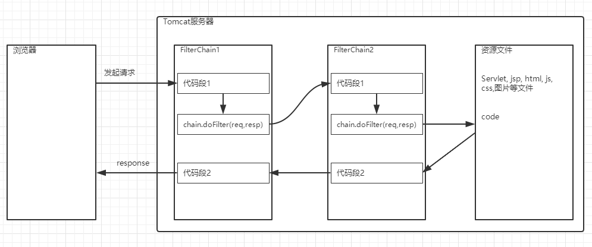

Filter过滤器
==

## 什么是Filter
* Filter是一个interface接口
* Filter是java web三大组件之一
    >Servlet小程序、Filter过滤器、Listener监听器
* Filter是服务器专门用来过滤(拦截)请求、响应，类似于哨卡的作用（进入之前、出来之后做些审问登记）

### Filter的常见作用
* 检查用户访问权限，权限管理
* 设置response编码，解决乱码问题


**案例**

* 需求
    ```text
    现在在WebContent目录下有一个目录admin，
    这个目录是管理员操作的目录，这个目录里有jsp、html、图片资源文件，
    现在我们要让这些资源都在用户登录后才能被访问，如何怎么实现这样的需求。
    ```

* session解决思路
    ```text
    我们可以在用户登录之后。把用户的信息保存在session域对象中，
    然后在jsp页面里通过session域对象获取用户的信息，如果用户信息存在，说明用户已登录;
    否则就重定向到登录页面。
    
    缺点：对于html、样式、图片文件则不会进行session判断，因此无法对这类资源无法鉴权
    ```

* Filter解决方案
```text
拦截匹配的URL，执行指定的Filter过滤器，在filter中判断客户关联的session是否有username信息
```


## 使用Filter步骤

1. 创建Filter类
    ```text
    示例javax.servlet.Filter接口
    ```
    [Filter类示例](../Filter/src/com/java/filter/Filter1.java)  
    
2. web.xml文件中配置Filter
    ```text
    <web-app>
    
        <!-- filter过滤器 -->
        <filter>
            <filter-name>Filter1</filter-name>
            <filter-class>com.java.filter.Filter1</filter-class>
        </filter>
    
        <!-- filter、url mapping -->
        <filter-mapping>
            <filter-name>Filter1</filter-name>
            <!-- 拦截的目录 -->
            <url-pattern>/admin/*</url-pattern>
        </filter-mapping>
        
        <!--
        也可以用Servlet匹配模式，URL由<servlet-mapping>设置决定，如：
        <filter-mapping>
            <filter-name>Filter1</filter-name>
            <servlet-name>ServletName</servlet-name>
        </filter-mapping>
        -->
    </web-app>
    ```


## Filter的生命周期
1. 执行Filter的构造方法，在tomcat启动时
2. 执行Filter的init方法，在tomcat启动时
3. 执行Filter的doFilter方法，每次请求时
4. 执行Filter的destroy方法，在tomcat关闭时

示例

* [测试Filter的生命周期](../Filter/src/com/java/filter/Filter2.java)  

* web.xml配置
    ```text
        <filter>
            <!-- 定义filter名称 -->
            <filter-name>Filter2</filter-name>
            <!-- Filter的具体实现类 -->
            <filter-class>com.java.filter.Filter2</filter-class>
            <!-- 配置初始化参数 -->
            <init-param>
                <!-- 参数名称 -->
                <param-name>sn</param-name>
                <!-- 参数值 -->
                <param-value>s1001</param-value>
            </init-param>
        </filter>
        
        <filter-mapping>
            <filter-name>Filter2</filter-name>
            <url-pattern>/transaction/recharge.jsp</url-pattern>
        </filter-mapping>
    ```
* 访问 http://localhost:8080/filter/transaction/recharge.jsp，查看控制台打印的信息


## FilterConfig类
```text
可以获取Filter在web.xml文件中的配置信息，做初始化之用。

可以在web.xml文件中给Filter添加初始化参数，
然后在init初始化方法中使用FilterConfig类获取到初始化的参数。
```
* 获取Filter名称
    >getFilterName()
* 获取filter初始化参数
    >getInitParameter(String parameterName);
* 获取ServletContext的对象实例
    >getServletContext()

[FilterConfig类使用示例 init方法中使用](../Filter/src/com/java/filter/Filter2.java)


## FilterChain过滤器链
```text
FilterChain是整个Filter过滤器的调用者，
Filter与Filter之间的传递、Filter与请求资源之间的传递都靠FilterChain.doFilter方法
```
### Filter的三个段
* 阶段1
    ```text
    FilterChain.doFilter方法之前的代码。
    一般用来做请求的拦截，检查用户访问的权限，访问日记的记录，参数编码的设置等等操作。
    ```

* 阶段2
    ```text
    FilterChain.doFilter方法。
    此方法可以将代码的执行传递到下一个Filter中，或者是传递到用户最终访问的资源中。
    ```

* 阶段3
    ```text
    FilterChain.doFilter之后的代码。
    主要用过做一些日记操作。我们很少会在第三段中做太多复杂的操作。
    ```

* 总结
    ```text
    阶段1、阶段3不是必须的，可以只有阶段2
    Filter的顺序为web.xml的上下，在上的优先
  
  
    在每一个Filter类的doFilter方法中，一定要调用chain.doFilter方法，
    除非你想要阻止用户继续往下面访问，否则一定要调用FilterChain的doFilter方法。
    ```


### 多个Filter过滤器的流转
  

示例

* 创建2个Filter
    * [FilterChain1](../Filter/src/com/java/filter/FilterChain1.java)
    * [FilterChain2](../Filter/src/com/java/filter/FilterChain2.java)
    
* web.xml配置Filter
    ```text
    <web-app>
        <filter>
            <filter-name>FilterChain1</filter-name>
            <filter-class>com.java.filter.FilterChain1</filter-class>
        </filter>
        <filter>
            <filter-name>FilterChain2</filter-name>
            <filter-class>com.java.filter.FilterChain2</filter-class>
        </filter>
    
        <filter-mapping>
            <filter-name>FilterChain1</filter-name>
            <url-pattern>/filterChain.jsp</url-pattern>
        </filter-mapping>
        <filter-mapping>
            <filter-name>FilterChain2</filter-name>
            <url-pattern>/filterChain.jsp</url-pattern>
        </filter-mapping>
    </web-app>
    ```

* [jsp资源文件](../Filter/web/filterChain.jsp)

* 浏览器访问 http://localhost:8080/filter/filterChain.jsp测试
    ```text
    tomcat控制台打印信息：
    
    访问资源前，FilterChain1 doFilter开始执行
    访问资源前，FilterChain2 doFilter开始执行
    这是请求的资源代码
    访问资源后，FilterChain2 doFilter执行结束
    访问资源后，FilterChain1 doFilter执行结束
    ```
    
### Filter的url-pattern匹配模式
* 精确匹配
    
    等于匹配
    ```text
    /static/css/common.css
    /xx/xxx/x.html
    ... 
    ```

* 目录匹配
    
    前缀匹配
    ```text
    /admin/*  表示工程的/admin/目录下的所有资源
    /*  当前工程下的所有资源，即匹配所有的url
    ```

* 后缀匹配
    ```text
    *.jsp  拦截所有后缀为jsp的url
    ```
* 总结
    ```text
    Filter对于不存在的资源也会匹配，是否应用Filter是由url-pattern决定的，只要url与设置的url匹配模式匹配就会应用Filter
    ```
    
