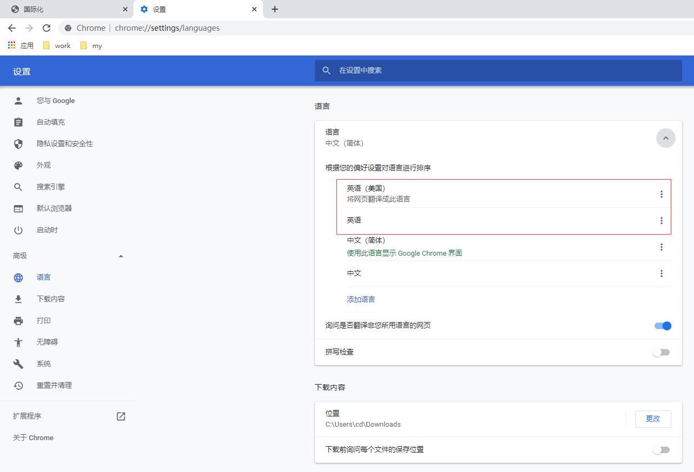
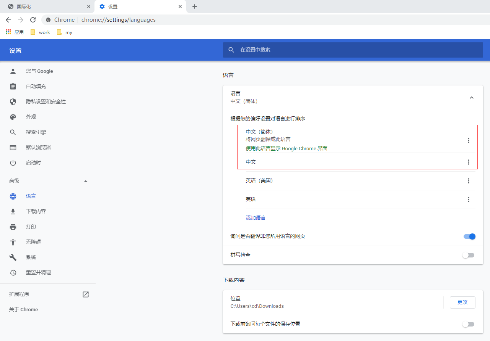

i18n国际化
==

## Table Of Contents
* [什么是i18n国际化](#什么是i18n国际化)
* [国际化的使用](#国际化的使用)
    * [国际化相关的类](#国际化相关的类)
    * [多国语言的资源配置文件命名规则](#多国语言的资源配置文件命名规则)
    * [通过请求头中的Accept-Language字段获取Locale地区信息](#通过请求头中的Accept-Language字段获取Locale地区信息)
    * [网站i18n国际化示例](#网站i18n国际化示例)


## 什么是i18n国际化
```text
国际化(Internationalization)指的是同一个网站可以支持不同的语言文字，方便不同国家、不同语言的用户访问。
网站国际化最简单的方案是为不同的国家创建不同的网站，如苹果公司，英文官网：https://www.apple.com
中国官网：https://www.apple.com.cn

这种方案不适合所有公司，我们希望相同的一个网站，可以根据用户所有的区域显示相应的语言文字，同时网站的布局和样式不变。
于是就有了我们说的国际化，国际化总的来说就是同一个网站不同国家的人来访问可以显示出不同的语言。
但实际上这种需求并不强烈，一般真的有国际化需求的公司，
主流采用的依然是苹果公司的那种方案，为不同的国家创建不同的页面。
所以国际化的内容我们了解一下即可。

i18n是Internationalization的缩写，18代表中间的18个字母
```

## 国际化的使用
国际化原理图


### 国际化相关的类
* Locale类
    >包含地区、语言信息
    
    [Locale类测试](../i18n/src/com/java/www/LocaleTest.java)
    
* ResourceBundle类
    >根据basename、locale信息读取相应的资源配配置文件
    

### 多国语言的资源配置文件命名规则
资源配置文件存放路径：在src/根目录下

* basename.properties
    >默认的语言
* basename_语言_国家.properties
    >具体的语言、国家信息

**示例**
```text
i18n.properties         默认的国际化资源配置文件
i18n_zh_CN.properties   中文_中国的国际化资源配置文件
i18n_en_US.properties   英语_中文的国际化资源配置文件
i18n_ko_KR.properties   韩语_韩国的国际化资源配置文件
```


### 通过请求头中的Accept-Language字段获取Locale地区信息
```text
request.getLocale();
通过请求头中的Accept-Language字段获取Locale地区信息
这是request对象的方法，

下面这种方功能果同上
// request headers包含信息：
// Accept-Language: en-US,en;q=0.9,zh-CN;q=0.8,zh;q=0.7
String localeStr = request.getHeader("Accept-Language").split(",")[0];
String[] loc = localeStr.split("-");
locale = new Locale(loc[0], loc[1]);
```

* 美国_英语 优先设置  
      
    
    请求头：
      

* 中国_中文 优先设置  
      
    
    请求头：
      


* 切换chrome浏览器UI语言的方法
      

### 网站i18n国际化示例
* [一般的国际化版](../i18n/web/i18n.jsp)
* [fmt标签的国际化版、国际化参数](../i18n/web/i18n_fmt.jsp)