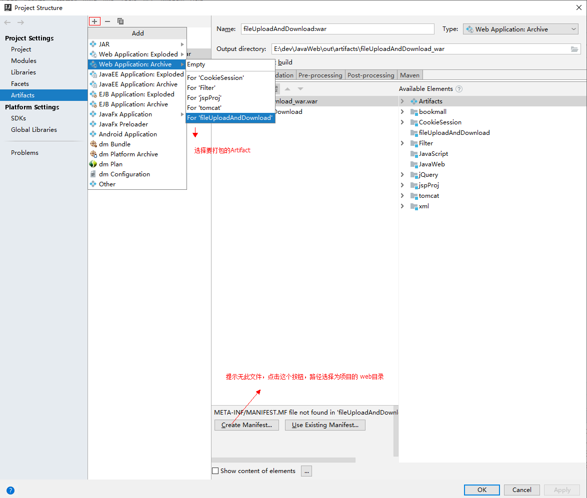

idea打包war包
==


## 打包war包步骤
```text
war包可直接部署到tomcat
```

1. 新建Web Application:Archive类型的Artifacts

      
    * Output directory：war包保存的目录
    * Type：选择Web Application:Archive
    
2. 编译打包
      
    Build / Build Artifacts...
    选择相应的Artifiac，点击Build，完成后，到步骤1中的Output directory目录中找
      
    
## 部署war包
* 把war包复制到tomcat的webapps目录下
* 重启tomcat服务即可
 