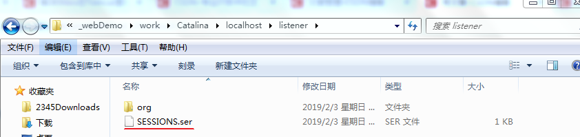

idea的Tomcat重启后session无法活化解决方法
==

## 分析idea tomcat重启session活化失败原因
* 定义一个可序列化类

    定义了一个Bean类实现了Serializable和HttpSessionActivationListener接口,并重写sessionWillPassivate()和sessionDidActivate()方法:(解决方法在最后)
    ```java
    public class Bean02 implements Serializable,HttpSessionActivationListener {
        private String name;
        
        public Bean02() {
        }
        
        public Bean02(String name) {
            this.name = name;
        }
        
        public String getName() {
            return name;
        }
        
        public void setName(String name) {
            this.name = name;
        }
        
        @Override
        public String toString() {
            return "Bean02{" +
                    "name='" + name + '\'' +
                    '}';
        }
        
        public void sessionWillPassivate(HttpSessionEvent httpSessionEvent) {
            System.out.println("Bean02被钝化了...");
        }
        
        public void sessionDidActivate(HttpSessionEvent httpSessionEvent) {
            System.out.println("Bean02被活化了...");
        }
    }
    ```

* 正常关闭tomcat服务器,session钝化了
    ```text
    Using CATALINA_BASE:   "C:\Users\Administrator\.IntelliJIdea2018.1\system\tomcat\_webDemo"
    Using CATALINA_HOME:   "D:\Develop\Tomcat\apache-tomcat-8.0.53"
    Using CATALINA_TMPDIR: "D:\Develop\Tomcat\apache-tomcat-8.0.53\temp"
    Using JRE_HOME:        "D:\Develop\Java\jdk1.8.0_181"
    Using CLASSPATH:       "D:\Develop\Tomcat\apache-tomcat-8.0.53\bin\bootstrap.jar;D:\Develop\Tomcat\apache-tomcat-8.0.53\bin\tomcat-juli.jar"
    03-Feb-2019 12:43:03.625 信息 [main] org.apache.catalina.core.StandardServer.await A valid shutdown command was received via the shutdown port. Stopping the Server instance.
    03-Feb-2019 12:43:03.625 信息 [main] org.apache.coyote.AbstractProtocol.pause Pausing ProtocolHandler ["http-apr-8080"]
    03-Feb-2019 12:43:03.682 信息 [main] org.apache.coyote.AbstractProtocol.pause Pausing ProtocolHandler ["ajp-apr-8009"]
    03-Feb-2019 12:43:03.733 信息 [main] org.apache.catalina.core.StandardService.stopInternal Stopping service Catalina
    Bean02被钝化了...
    03-Feb-2019 12:43:03.773 信息 [main] org.apache.coyote.AbstractProtocol.stop Stopping ProtocolHandler ["http-apr-8080"]
    03-Feb-2019 12:43:03.846 信息 [main] org.apache.coyote.AbstractProtocol.stop Stopping ProtocolHandler ["ajp-apr-8009"]
    03-Feb-2019 12:43:03.900 信息 [main] org.apache.coyote.AbstractProtocol.destroy Destroying ProtocolHandler ["http-apr-8080"]
    03-Feb-2019 12:43:03.901 信息 [main] org.apache.coyote.AbstractProtocol.destroy Destroying ProtocolHandler ["ajp-apr-8009"]
    Disconnected from server
    ```

* 生成了SESSIONS.ser
    ```text
    Using CATALINA_BASE:   "C:\Users\Administrator\.IntelliJIdea2018.1\system\tomcat\_webDemo" 目录下
    
    多了一个SESSIONS.ser文件,就是session钝化后生成的文件
    ```
    
      

* 再次启动tomcat，session激化失败原因
    ```text
    下面问题就来了,按理说再次启动tomcat服务器,应该加载session信息到浏览器,调用 sessionDidActivate()这个方法,
    并且在页面中能获取到这个session中存的值,但是实际情况出入很大.
    
    再次启动后,没有调用 sessionDidActivate()方法,浏览器端也获取不到重启前存入的对象.
    
    于是我盯着这个SESSIONS.ser来回重启Tomcat好几次,发现每次重启Tomcat,
    Using CATALINA_BASE:   "C:\Users\Administrator\.IntelliJIdea2018.1\system\tomcat\_webDemo"
    这个目录下的work目录都要删除然后重新生成,而SESSIONS.ser这个文件也存在这个目录中,
    每次重启都会删除掉,当然无法活化了
    ```
    
* session激化失败解决方法

    在${TOMCAT_HOME}/conf 下的context.xml文件的Context节点下添加以下内容:
    ```xml
    <!-- 重启时保存session到文件 -->
    <!-- <Manager className="org.apache.catalina.session.PersistentManager" saveOnRestart="true"> -->
    <!-- 空闲x分钟的session从内存转移保存到文件 -->
    <Manager className="org.apache.catalina.session.PersistentManager" maxIdleSwap="15">
        <Store 
            className="org.apache.catalina.session.FileStore" 
            directory="D:\tomcat\apache-tomcat-9.0.30\session" 
        />
    </Manager>
    ```
    directory="xxx\xxx\..."是序列化后的文件存储路径,自己定义即可

* 对比Eclipse
    ```text
    ps:Eclipse和idea不同,直接在${TOMCAT_HOME}\work\Catalina\localhost\项目名称中生成SESSIONS.ser,
    重启tomcat就能实现活化的功能,无需以上的这些设置.
    ```
    
## Tomcat中两种Session钝化管理器
```text
session钝化机制是由sessionManager管理 
tomcat提供了以下这两种session处理方式:

org.apache.catalina.session.StandarManager  默认处理方式
org.apache.catalina.session.Persistentmanager
```
* StandarManager
    ```text
    当Tomcat服务器关闭或者重启时tomcat服务器会将当前内存中的session对象钝化到服务器文件系统中； 
    另一种情况是web应用程序被重新加载时(其实原理也是重启tomcat)，内存中的session对象也会被钝化到服务器的文件系统中 
    当系统启动时，会把序列化到硬盘上session重新加载到内存中来。这样用户还保持这登录状态，提供系统的可用性。
    
    只有在tomcat关闭和启动的时候才会活化和钝化session
    强制kill掉tomcat是不会把session钝化到硬盘上的。
    ```
* Persistentmanager
    ```text
    可以将内存中长时间不用的session钝化到硬盘上，减少内存的占用。
    
    比如：当网站有大量用户访问的时候，服务器会创建大量的session，会占用大量的服务器内存资源，
    当用户开着浏览器一分钟不操作页面的话建议将session钝化，将session生成文件放在tomcat工作目录下。
    ```
