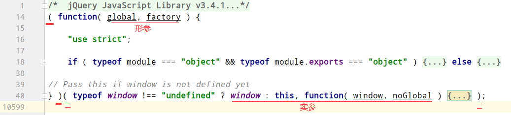
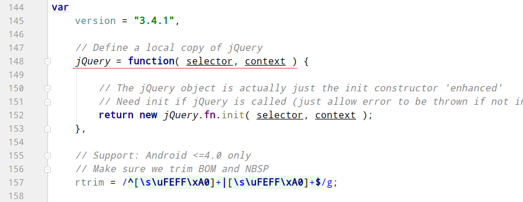

jQuery
==

## 概述
```text
jQuery: JavaScript和Query，是辅助JavaScript开发的js类库

核心思想：write less, do more，写得少，做得多

功能：操作文档对象、选择DOM元素、制作动画效果、事件处理、使用Ajax以及其他功能

官网：https://jquery.com
```

## jQuery的使用
* 导入jQeury js库文件
    ```html
    <head>
        <script type="text/javascript" src="js/jquery-3.4.1.js"></script>
    </head>
    ```
* 在页面加载完之后，查找节点，然后在节点对象上绑定事件  

* js加载时间顺序
    ```js
    // DOM准备就绪时，即DOM加载完成之后，这时候页面可能并没有正常显示出来
    $(document).ready(function() {
      
    });
    
    // 简写
    $().ready(function() {
      
    });
    
    // 简写
    $(function() {
      
    });
    ```
* $(document).ready() vs window.onload()
    * window.onload(): 页面准备就绪完成时
        >要等到页面中所引用的图片等外部资源 完全下载完成后并且在浏览器中显示才执行
    * $(document).ready():  DOM准备就绪完成时，早于window.onload()

## jQuery本质
```text
jQuery本质是js函数，一个立即执行函数

```
```js
(function (global, factory) {})(
    typeof window !== "undefined" ? window : this, function(window, noGlobal) {
    }
    // 上面的this为window，因为由此对象来加载jQeury库
);

// 最终执行了 
// 若想node.js 使用了 module.exports，则调用
factory(global, true ); // global 为window

// 一般的
factory(global); //global 为window， noGlobal没传，调用时为undefined
```
  

## jQuery中的$本质
```text
$为window.$的简写，是js函数，jQeury中的核心函数，一个object对象
```
```js
if ( !noGlobal ) {
	window.jQuery = window.$ = jQuery;
}

/**
* 一般情况下，noGlobal为undefined，即为false
* 此时 window.$ = jQuery;
* window.jQuery = jQuery;
* 
* 而jQuery是一个函数。
* 另外 window.$，在使用时也可以省去window，即$，效果同调用window.$
* window.jQuery同上
*/


/**
* jQuery函数
* 
* jQuery对象都是 jQuery.fn.init 的实例
*/
var
	version = "3.4.1",

	// Define a local copy of jQuery
	jQuery = function( selector, context ) {

		// The jQuery object is actually just the init constructor 'enhanced'
		// Need init if jQuery is called (just allow error to be thrown if not included)
		return new jQuery.fn.init( selector, context );
	},

	// Support: Android <=4.0 only
	// Make sure we trim BOM and NBSP
	rtrim = /^[\s\uFEFF\xA0]+|[\s\uFEFF\xA0]+$/g;

```

  
  

## jQeury核心函数$()
$()函数能完成很多功能，可链式编程，即对象方法之后再.方法、.属性等


* $(函数)
    ```text
    $(function(){})  表示DOM就绪之后(DOM加载完成之后)，执行传入的函数
    $(function(){})  是一种简写形式
    ```
    ```js
    //jq的写法
    $(document).ready(function(){
        //do something
    });
    //简写，默认document
    $().ready(function(){
        // do somethin
    });
    // 简写
    $(function(){
        // do something
    });
    ```
* $(inner.HTML字符串)
    创建HTML标签对象
    ```js
    $("<div><span>12</span></div>");
    
    // 相当于
    var spanObj = document.createElement("span");
    spanObj.innerHTML = 12;
    var divObj = document.createElement("div");
    divObj.appendChild(spanObj);
    ```

* $(选择器字符串)  
    jQuery选择器，获取jQuery对象  
    使用规则见 http://jquery.cuishifeng.cn
    ```js
    $("#id属性值")  // id选择器
    $(".class属性值")  // 类选择器
    $("标签名 ")  // 标签选择器
    ```

* $(DOM对象)
    传入的DOM对象转换成jQuery对象。jQuery选择器也是jQuery对象
    ```js
    // DOM对象，如类似下面这种方式获取到的对象，就是DOM对象
    var domObj = document.getElementById("id属性值");
    
    // jQuery对象，如类似下面这种方式获取到的对象，就是jQuery对象
    var jqueryObj = $(domObj);
    var jqueryObj2 = $("选择器");
    ```
 
## jQuery对象与DOM对象
### 概念
* DOM对象
    ```text
    直接通过document对象的方法创建的节点、或是查找到的节点，就是DOM对象.
    console.log(DOM对象);显示的为HTMLCollection对象
    如 
    var divObj = document.getElementById("id属性值");
    var spanObj = document.createElement("span");
    ```
* jQuery对象
```text
通过jQuer接口创建的对象、jQuer接口查询到的对象、jQuery包装的DOM对象，就是jQue对象
console.log(jQuery对象);显示的为jQuery.fn.init对象
```

### JQuery对象的本质
```text
Jquery对象本质是一个数组，该数组素由dom对象数组、一系列jquery对象提供的方法组成
```

### jQuery对象和DOM对象使用区别
* DOM对象的属性和方法不能被jQuery对象使用
* jQuery对象的属性和方法也不能被DOM对象使用

### jQuery对象与DOM对象互转
* DOM对象转jQuery对象
    ```js
    var DOM对象 = document.getElementByXxx("属性值"); // Xxx为Id、name、class等
    var $jq对象 = $(DOM对象);
  
    // 在遍历jQuery对象时，元素为DOM对象，为更好的使用jQuery方法，把DOM对象转jQeury对象
    $("select[name=itme1]:selected").each(function () {
        $(this).appendTo($("select[name=itme2]"));
    });
    ```

* jQuery对象转DOM对象
    ```js
    var $jq对象 = $("选择器字符串");
    var DOM对象 = $jq对象[index值];
    ```

## jQuery选择器
jQuery选择器与css选择器是一样的，参考 http://jquery.cuishifeng.cn  
选择返回的jQuery对象为一个由n个DOM对象和一些方法组成的数组，  
**调用方法时，可以直接用数组对象.方法名()**  
**调用数据里面的DOM对象元素时，需要指定具体的元素，如 jqArr[0].checked**


### 基本选择器
```text
#id  id选择器，返回一个元素，或0个元素。
element  标签选择器
.class  类选择器
*  匹配所有元素
selector1,selector2,selectorN  多个选择器的并集
```

### 层级选择器
```text
ancestor descendant  匹配ancestor后代元素为descendant的元素
parent > child  匹配parent的子元素为child的元素
prev + next  匹配跟在 prev 后为 next 的next这个兄弟元素
             prev与next为同级
prev ~ siblings  查找与prev同辈的兄弟元素中为siblings的元素 （不包括prev）
                 prev与siblings为同级
```

### 基本筛选器
```text
:first  第一元素
:not(selector)  不是selector的元素
:even  匹配所有索引为偶数的元素
:odd  匹配所有索引为奇数的元素
:eq(index)  匹配索引=index的元素
:gt(index)  匹配索引>index的元素
:lt(index)  匹配索引<index的元素
:lang
:last  最后一个元素
:header  匹配如 h1, h2, h3之类的标题元素
:animated  匹配所有正在执行动画效果的元素
:focus  匹配当前获取焦点的元素
:root  选择该文档的根元素，即HTML标签
:target  
```

### 内容选择器
```text
:contains(text)  匹配包含给定文本的元素
:empty  匹配所有不包含子元素或者文本的空元素
:has(selector)
:parent  匹配含有子元素或者文本的元素
```

### 可见性选择器
```text
:hidden  匹配所有不可见元素，或者type为hidden的元素
:visible  匹配所有的可见元素
```
### 属性选择器
```text
[attribute]  匹配包含给定属性的元素
[attribute=value]  查找属性attribute值 = value的元素
[attribute!=value]  查找属性attribute值 != value的元素
[attribute^=value]  查找属性attribute值 以 value开头的元素
[attribute$=value]  查找属性attribute值 以 value结尾的元素
[attribute*=value]  查找属性attribute值 包含 value的元素
[attrSel1][attrSel2][attrSelN]  同时满足多个属性条件
```
### 子元素选择器
```text
:first-child  匹配所给选择器( :之前的选择器)的第一个子元素
:first-of-type  等价于:nth-of-type(1) 选择器
:last-child  匹配所给选择器( :之前的选择器)的最后一个子元素
:last-of-type  等价于:nth-of-type(1) 选择器
:nth-child
:nth-last-child()
:nth-last-of-type()
:nth-of-type()
:only-child
:only-of-type
```
### 表单选择器
```text
:input  匹配所有 input、textarea、select、button元素
:text  匹配所有的单行文本框
:password  匹配所有的密码框
:radio  匹配所有单选按钮，即type="radio"的input元素
:checkbox  匹配所有复选框
:submit  匹配所有提交按钮
:image
:reset
:button
:file
```
### 表单对象属性选择器
```text
:enabled  可用的元素
:disabled  不可用的元素
:checked  已选中的,匹配所有选中的单选，复选，和下拉列表中选中的option标签对象
:selected  已选中的下拉列表选项,匹配所有选中的option
```

## jQuery常用方法
* jQuery.each(object, [callback])
```text
object:需要遍历的对象或数组。
callback:每个成员/元素执行的回调函数
```
```js
// 遍历数组，同时使用元素索引和内容
$.each( [0,1,2], function(i, n){
    alert( "Item #" + i + ": " + n );
});

// 遍历对象，同时使用成员名称和变量内容
$.each( { name: "John", lang: "JS" }, function(i, n){
    alert( "Name: " + i + ", Value: " + n );
});
```

* $("选择器").each(function () {});
```js
$("选择器").each(function () {
    console.log(this); // this为选择器匹配的元素数组中的遍历的一个一个元素
});
```
* $("选择器").each(function (i) {});
```js
$("选择器").each(function (i) { // 这里的i为选择器匹配的元素数组遍历时的下标
});  
```
* $("选择器").each(function (i, n) {});
```js
$("选择器").each(function (i, n) { // 这里的i为选择器匹配的元素数组遍历时的下标，n为元素
}); 
```

## extend插件机制
### jQuery.fn.extend(object)
扩展 jQuery 元素集来提供新的方法，通常用来制作插件。  
更多可查看https://learn.jquery.com/plugins/
```js
// 需要先引入jQeury库文件

(function () {
    // 为jQuery扩展方法
    $.fn.extend({
        checkedAll: function () {
            this.prop('checked', true);
        },
        checkedNo: function () {
            this.prop('checked', false);
        },
        checkedReverse: function () {
            this.each(function () {
                this.checked = !this.checked;
            });
        }
    });
        
    window.onload = function () {
        var cityitemsInputs = $("input:checkbox");
        // 绑定事件
        $("#checkedAllBtn")[0].onclick = function (e) {
            $("input:checkbox").checkedAll();
            // // 阻止<button>按钮的reload事件
            // return false;

            // 或
            e.preventDefault();  // 阻止默认事件
        };
    };
})();
```

### jQuery.extend(object)
扩展jQuery对象本身，用来在jQuery命名空间上增加新函数
```js
(function () {
    // 扩展jQuery本身的函数
    $.extend({
        // 求最小数
        min: function () {
            // console.log(arguments);
            var minValue = null;
            if (arguments.length === 0) {

            } else if (arguments.length === 1) {
                minValue = $.isNumeric(arguments[0]) ? arguments[0] : null;
            } else {
                $.each(arguments, function (index, element) {
                    if ($.isNumeric(element)) {
                        if (minValue === null) {
                            minValue = element;
                        } else {
                            minValue = minValue < element ? minValue : element;
                        }
                    }
                });
            }
            return minValue;
        },
        // 求和
        sum: function () {
            var sumValue = null;
            $.each(arguments, function (index, element) {
                if ($.isNumeric(element)) {
                    element = element * 1;
                    if (sumValue === null) {
                        sumValue = element;
                    } else {
                        sumValue += element;
                    }
                }
            });
            return sumValue;
        }
    });
    
    $(function() {
        var numInputs = $(".numEnter input[type=number]");
        $(".min").click(function () {
            console.log($.min(numInputs[0].value, numInputs[1].value, numInputs[2].value));
        });
        $(".sum").click(() => {
            console.log($.sum(numInputs[0].value, numInputs[1].value, numInputs[2].value));
        });
    });
})();
```

[extend插件机制](../jQuery/web1/extend插件机制.html)  


    

## jQuery的ajax方法
### get方法
语法
```text
$.get(url, [data], [callback], [type]);

参数
url: 待载入页面的URL地址

data: 待发送 Key/value 参数

callback: 载入成功时回调函数

type: 返回内容格式，xml, html, script, json, text, _default
```

示例
```js
$.get(
    "test.cgi", 
    { name: "John", time: "2pm" },
    function (data) { // data为服务端响应给客户端的数据
        alert("Data Loaded: " + data);
    }
);
```

### post方法
语法
```text
$.post(url, [data], [callback], [type]);

参数
url: 发送请求地址。

data: 待发送 Key/value 参数

callback: 发送成功时回调函数

type: 返回内容格式，xml, html, script, json, text, _default
```

示例
```js
send_data = JSON.stringify({user: "mali", email: "mali@qq.com"});

$.post(window.location.pathname + window.location.search, {data:send_data},
    function(callback){ // callback为服务端响应给客户端的数据
        callback = JSON.parse(callback)['data'];
        if (callback['auth_status'] == '1'){ // 登录成功
            location.href = callback['url'];
        }else if(callback['auth_status'] == '0'){ // 登录失败
            $('.login-box-msg').text('用户或密码错误,请重新输入').css('color','red');
        }
});
```


### ajax方法
[语法](http://jquery.cuishifeng.cn/jQuery.Ajax.html)

```text
$.ajax({url: url_val, [settings]})

参数
url:一个用来包含发送请求的URL字符串

settings:AJAX 请求设置。所有选项都是可选的
一般都传入一个字典类型的对象，用k-v来表示各个参数

jQuery 底层 AJAX 实现
以上两个是简单易用的高层实现
```

* url
    ```text
    一个用来包含发送请求的URL字符串
    ```

* 回调函数  
    用于处理$.ajax()获得的数据，
    * beforeSend
        >在发送请求之前调用，并且传入一个XMLHttpRequest作为参数
    * error
        >在请求出错时调用。传入XMLHttpRequest对象，描述错误类型的字符串以及一个异常对象（如果有的话）
    * dataFilter
        >在请求成功之后，且在success函数之前调用。传入返回的数据以及"dataType"参数的值。并且必须返回新的数据（可能是处理过的）传递给success回调函数
    * success
        >当请求成功之后调用(dataFilter函数之后)。传入返回后的数据，以及包含成功代码的字符串
    * complete
        >当请求完成之后调用这个函数，无论成功或失败。传入XMLHttpRequest对象，以及一个包含成功或错误代码的字符串

* type
```text
请求方法
可选
"GET"  默认值
"POST"
"PUT"
"DELETE"

```

* dataType数据类型  
    ```text
    $.ajax()函数依赖服务器提供的信息来处理返回的数据。
    如果服务器报告说返回的数据是XML，那么返回的结果就可以用普通的XML方法或者jQuery的选择器来遍历。
    如果想得到其他类型，比如HTML，则数据就以文本形式来对待。
    
    可设置类型：
    "xml", "html", "script", "json", "jsonp", "text"
    ```

* data发送个给服务到的数据
    ```text
    数据可以是一个查询字符串，如："key1=value1&amp;key2=value2"
    也可以是字典对象，如：{key1: "value1", key2: "value2"}，对象类型的数据在发送时会被转换成查询字符串。
    
    这时可通过processData选项为false来回避。但如果是发送一个XML对象给服务器就不合适了
    ```
* async是否异步
    ```text
    可选值: 
        true  默认值，默认发起的是异步的请求
        false  关闭异步请求，即为同步请求
    ```
* contentType
    ```text
    设置请求头contentType值，即发送信息至服务器时内容编码类型
    ```
* username
    ```text
    用于响应HTTP访问认证请求的用户名
    ```

* password
    ```text
    用于响应HTTP访问认证请求的密码
    ```
* processData
    ```text
    (默认: true) 默认情况下，通过data选项传递进来的数据，如果是一个对象(技术上讲只要不是字符串)，
    都会处理转化成一个查询字符串，以配合默认内容类型 "application/x-www-form-urlencoded"。
    如果要发送 DOM 树信息或其它不希望转换的信息，请设置为 false。
    ```
* crossDomain是否跨域
```text
可选值
true  强制跨域请求，如JSONP形式
false  默认值，不跨域
```

高级选项
* cache是否启用缓存
    ```text
    可选值：
        true  默认值，默认情况下，请求总会被发出去，但浏览器有可能从他的缓存中调取数据
        false  关闭缓存，将不缓存此页面
    ```
* scriptCharset设置字符集
    ```text
    只有当请求时dataType为"jsonp"或"script"，并且type是"GET"才会用于强制修改charset。通常只在本地和远程的内容编码不同时使用。
    ```
* success: function (data, status, jqXHR) {}
```text
请求成功后的回调函数

参数
data  由服务器返回，并根据dataType参数进行处理后的数据
status  描述状态的字符串，如"200"
jqXHR  XMLHttpRequest对象
```

* timeout
    ```text
    设置请求超时时间（毫秒）。此设置将覆盖全局设置
    ```

示例
```js
function signup() {
    $.ajax({
        // 提交数据的类型 POST GET
        type: "POST",
        // 提交的网址
        url: "testLogin.aspx",
        // 提交的数据
        data: {Name:"sanmao",Password:"sanmaoword"},
        // 返回数据的格式
        datatype: "html",//"xml", "html", "script", "json", "jsonp", "text".
        // 在请求之前调用的函数
        beforeSend: function(){$("#msg").html("logining");},
        // 成功返回之后调用的函数             
        success: function(data){
       $("#msg").html(decodeURI(data));            
        }   ,
        // 调用执行后调用的函数
        complete: function(XMLHttpRequest, textStatus){
           alert(XMLHttpRequest.responseText);
           alert(textStatus);
            //HideLoading();
        },
        // 调用出错执行的函数
        error: function(){
            // 请求出错处理
        }         
    });
}
```

## jQuery对象常用方法
* 从祖先元素中找匹配的元素
    ```js
    $(this).parents("tr")
    ```
* 从后代元素中找匹配的元素
    ```js
    $(this).find("td:eq(0)");
    ```
* 获取父元素
    ```js
    $("选择器").parent();
    ```
* 从当前元素中过滤
    ```js
    // 注意：filter上条件为li上的，而不是li的后代元素的条件
    $(".logo li").filter(".user");
    ```
* 创建元素
    ```js
    // 创建如下节点
    /*
    <tr>
        <td>name</td>
        <td>email</td>
        <td>salary</td>
    </tr>
     */
    $("<tr></tr>").append("<td>" + name + "</td>")
        .append("<td>" + email + "</td>")
        .append("<td>" + salary + "</td>");
    
  
    // 也可以这样
    $("<tr> \
           <td>name</td> \
           <td>email</td> \
           <td>salary</td> \
       </tr>");
    ```

* appendTo把jQuery对象剪切到指定位置
    ```js
    $("<tr></tr>").append("<td>" + name + "</td>")
        .append("<td>" + email + "</td>")
        .append("<td>" + salary + "</td>")
        .append('<td><a href="javascript: void(0);">Delete</a></td>')
        .appendTo(".employeeTab");  // appendTo指定目标选择器
    ```
* 向每个匹配的元素追加内容，内容可以是text后HTML
    ```js
    append(content|fn)
    ```
* 隐藏元素
    ```js
    $("选择器").hide();
    ```
* 显示元素
    ```js
    $("选择器").show();
    ```
* 淡入淡出
```text
fadeIn([speed],[easing],[fn])   淡入
    speed:三种预定速度之一的字符串("slow","normal", or "fast")或表示动画时长的毫秒数值(如：1000)
    easing:(Optional) 用来指定切换效果，默认是"swing"，可用参数"linear"
    fn:在动画完成时执行的函数，每个元素执行一次。
    
fadeOut([speed],[easing],[fn])    淡出
    speed:三种预定速度之一的字符串("slow","normal", or "fast")或表示动画时长的毫秒数值(如：1000)
    easing:(Optional) 用来指定切换效果，默认是"swing"，可用参数"linear"
    fn:在动画完成时执行的函数，每个元素执行一次。
    
fadeTo([[speed],opacity,[easing],[fn]])    调整透明度
    speed:三种预定速度之一的字符串("slow","normal", or "fast")或表示动画时长的毫秒数值(如：1000)
    opacity:一个0至1之间表示透明度的数字。
    easing:(Optional) 用来指定切换效果，默认是"swing"，可用参数"linear"
    fn:在动画完成时执行的函数，每个元素执行一次。
```

* 获取HTML代码

* val获取值
    ```js
    /**
    * 单选、复选框、select获取的值为数组。即 checked/seleced 的值
    * 文本、密码等，获取的值为单个
    * 
    * 单选、复选框、select时，选择器需要选择 checked/seleced属性
    */
    $("选择器").val();
    ```

* val设置值
    ```js
    $("选择器").val(val|fn|arr)
    /*
    val  String
    要设置的值。
    
    function(index, value)  Function
    此函数返回一个要设置的值。接受两个参数，index为元素在集合中的索引位置，text为原先的text值。
    
    array  Array<String>
    用于 checked/selected 的值
     */
    ```

* 获取text
    ```js
    $("选择器").text();
    ```
* 设置text
    ```js
    $("选择器").text(val|fn);
    /*
    val   String
    用于设置元素内容的文本
      
    function(index, text)   Function
    此函数返回一个字符串。接受两个参数，index为元素在集合中的索引位置，text为原先的text值。
     */
    ```
    
* 给img标签添加src值
    ```js
    $(".zoomdiv img").prop("src", "./img/bigphone.jpg");
    // 或
    $(".zoomdiv img").attr("src", "./img/bigphone.jpg");    
    ```
* 解决鼠标mousemove事件时遮罩层闪烁抖动
    ```text
    在遮罩层上添加如下的css
    作用：此元素不再是鼠标事件的目标，鼠标不再监听当前层而去监听下面的层中的元素
    使得超链接和按钮等鼠标点击事件都会失效
    ```
    ```css
    pointer-events: none;
    ```
   
## jQeury示例
* [隔行变色](../jQuery/web1/01_隔行变色.html)
* [全选、全不选、反选](../jQuery/web1/02_全选、全不选、反选.html)
* [表单选择器](../jQuery/web1/03_表单选择器.html)
* [选项左到右、右到左](../jQuery/web1/04_选项左到右、右到左.html)
* [添加删除记录](../jQuery/web1/05_添加删除记录.html)
* [CSS_动画_品牌展示](../jQuery/web1/06_CSS_动画_品牌展示.html)
* [事件_图片跟随](../jQuery/web1/07_事件_图片跟随.html)
* [京东放大查看商品图](../jQuery/web1/08_京东放大查看商品图.html)
* [京东放大查看商品图2](../jQuery/web1/08_京东放大查看商品图2.html)
* [同时设置表单的多个值](../jQuery/web1/09_同时设置表单的多个值.html)
* [动画](../jQuery/web1/10_动画.html)

 
## 其他
* **对加载后，动态生成的DOM对象上同样自动绑定事件方法**
    ```js
    // 我的域名 分页导航绑定点击事件。
    // DomainPage为方法，{'optype': 2}为要传的参数，需要用字典，不传参可以省略此字段
    $(document).on("click", "#domain_box button[name=jump-page]", {'optype': 2}, DomainPage);
    
    function DomainPage(event){
      if (event.data.optype == 1){
          
      }
    }
    ```
    ```js
    // 该方式，只针在DOM准备就绪后，绑定一次，之后动态生成的DOM对象匹配，即使匹配选择器字，不会自动绑定该事件
    $("选择器字符串").bind('事件名', 方法名);
    ```
* jQuery对象绑定事件方式
    * jQuery对象.事件名(方法名);
        ```js
        $("选择器字符串").click(方法名或匿名函数);
        ```
    * jQuery对象.bind(type, [selector], [data], fn)
        >css 3.0弃用，建议使用on()
    * jQeury对象.on(events, [selector], [data], fn)
        >当一个事件被触发时要传递event.data给事件处理函数，用{}字典来传包装多个数
    * $(document).on(events, selector, [data], fn);
        ```text
        建议使用此方法，动态生成的DOM对象同样也能绑定上设置的事件  
  
        events: 字符串形式，可以为多个事件，多个事件之间用","分隔，
        selector: 选择器的字符串
        data: 用{}字典来传包装多个数，函数定义一个参数event，接收参数方法 event.data，此对象即为这里传递的data
        fn: 方法
        document参数不能省略
        ```

* form标签内的button标签默认有reload重载事件
    即点击button标签，就会重新加载页面，放回false则会阻止
* 阻止默认事件
    * 方式1：函数最后返回false
    * 方式2：利用事件，event.preventDefault();
        ```js
        function func1() {}

        $(".logo").on('click', {opt: 1}, function(event) {    
            func1();
            event.preventDefault(); // 只会阻止默认事件，但不会阻止冒泡事件
            // 或return false; // 同时阻止 默认事件 和冒泡事件
        });
        ```

* 阻止冒泡事件
    * 方式1：函数最后返回false
    * 方式2：利用事件，event.stopPropagation();
        ```js
        function func1() {}
        
        $(".logo").on('click', {opt: 1}, function(event) {    
            func1();
            event.stopPropagation();
            // 或return false;
        });
        ```
