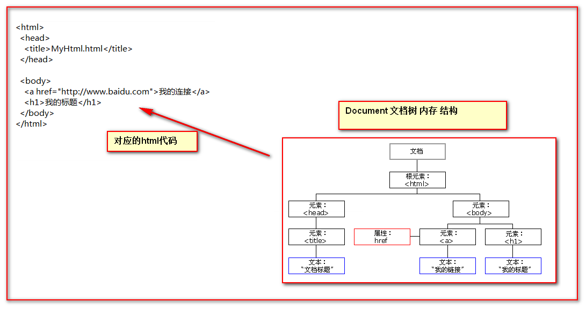

JavaScript
==


## 概述
```text
JavaScript是一种具有函数优先的轻量级，解释型或即时编译型的编程语言。
是一种属于网络的脚本语言,已经被广泛用于Web应用开发,常用来为网页添加各式各样的动态功能,
为用户提供更流畅美观的浏览效果。
与java没有关系
```

## javascript代码与html代码结合的方式
* 在head或body标签内添加script标签  
    head标签内  
    ```html
    <!DOCTYPE html>
    <html lang="en">
    <head>
        <meta charset="UTF-8">
        <title>Title</title>
        <script type="text/javascript">
            alert("hi javascript");
        </script>
    </head>
    <body>
    </body>
    </html>
    ```
    
    body标签内(推荐)  
    ```html
    <!DOCTYPE html>
    <html lang="en">
    <head>
        <meta charset="UTF-8">
        <title>Title</title>
    </head>
    <body>
        <div>
            请按F12打开Console控制台
        </div>
        <script type="text/javascript">
            console.log("^_^, javascript lable in body");
        </script>
    </body>
    </html>
    ```
* 在head标签内引入javascript代码文件  
    路径可以使用先对路径，或URL地址  
    ```html
    <!DOCTYPE html>
    <html lang="en">
    <head>
        <meta charset="UTF-8">
        <title>Title</title>
        <script type="text/javascript" src="./js/common.js"></script>
    </head>
    <body>
    </body>
    </html>
    ```

**也可以两种方式同时使用**  

## 变量
### 定义变量格式
* var声明的标量为局部变量
* 无var声明的标量为全局变量
* var、let、const声明变量区别
    * var定义的变量可以修改，作用域为方法级，如果不初始化会输出undefined，不会报错。
    * let是块级作用域，函数内部使用let定义后，对函数外部无影响。在变量声明之前就访问变量的话，会直接提示 ReferenceError
    * const定义的变量不可以修改，而且必须初始化，作用域为方法级


```js
var name; // 局部变量
var height = 180;

nation = "china"; // 全局变量
```


### 变量类型
* number：数值类型
* string：字符串类型
* boolean：布尔类型
* object：对象类型
    * array：数组
    * 字典
* function：函数类型

#### number
```js
// number
var num = 2;
var age = Number(18);
var a1 = 1, a2 = 2, a3 = 3;

```
* 字符串解析为数值
    ```js
    var n1 = parseInt("1.2"); // 1
    var n2 = parseFloat("1.2"); // 1.2
    console.log(n1, n2);
    ```

#### string
```js
// string
var name = "pikaqs";
var theam = String("black");
var age_str = String(18);
```

* string对象常用方法
    ```js
    // 去掉空格
    obj.trim()
    
    // 去掉左空格
    obj.trimLeft()
    
    // 去掉右空格 
    obj.trimRight()
    
    // 根据下标查找字符
    obj.charAt(index)
    
    // 根据下标查找子字符串
    obj.substring(start,end)
    
    // 根据字符查找下标
    obj.indexOf(char)
    
    // 字符串长度
    obj.length     
    ```

#### boolean
```js
// boolean
var status = true;
var siClose = false;
var flag1 = Boolean(1); // 非0数值为true
var flag2 = Boolean(0); // false
console.log(flag1, flag2);
console.log(typeof(flag1));
```
* typeof(对象)
    ```text
    获取对象的类型
    ```

#### object
##### array
```js
// Array
var arr = []; // 空数组
var person = ['tom', 'cherry', 'rich'];
var person2 = Array('tom', 'cherry', 'rich');
console.log(typeof(person2)); // object
console.log(person[0]);

// 遍历数组
// 一般的for
console.log("-- 一般的for 遍历数组 --");
for (let i = 0; i < person.length; ++i) {
    console.log(person[i]);
}

// for-in
console.log("-- for-in 遍历数组 --");
for (var i in person) {
    console.log(person[i]);
}

// forEach
console.log("-- forEach function 遍历数组 --");
person.forEach(function (p) {
    console.log(p);
})

console.log("-- forEach lambda 遍历数组 --");
person.forEach(p => {
    console.log(p);
})

console.log("-- end 遍历数组 --");
```
* 数组对象常用方法
    ```text
    * 添加
        obj.push(ele)                   追加
        obj.unshift(ele)                最前插入
        obj.splice(index,0,'content')   指定索引插入
    * 移除
        obj.pop()                       数组尾部获取
        obj.shift()                     数组头部获取
        obj.splice(index,count)         数组指定位置后count个字符
      
    *切片
        obj.slice(start,end)          
    * 合并
        newArray ＝ obj1.concat(obj2)  
    * 翻转
        obj.reverse()
      
    * 字符串化：用指定的字符串连接每个元素
        obj.join('_')
    * 长度
        obj.length
    ```
##### 字典
```js
// dictionary
var dic = {}; // 空字典
var items = {k1: "v1", k2: "v2"}; // 标准写法, key为字符串，无需用引号包裹key
var items2 = {items: '00', 'addr': "中金大道"};
console.log(items.k1);
var a = {k1: "v1", k2: "v2"};
console.log(a);
console.log(items);
console.log(items2.items); // 00
console.log(items2['items']); // 00
console.log(typeof(items2));

// 遍历字典
console.log("-- 遍历字典 --");
for (var k in items) {
    console.log(items[k]);
}
console.log("-- end 遍历字典 --");
/* end object */
```

* 序列化：对象转字符串
    ```js
    var a = {k1: "v1", k2: "v2"};
    var b = JSON.stringify(a);
    console.log(b); // '{"k1":"v1","k2":"v2"}'
    ```
* 反序列化：字符串转对象
    ```js
    var stu = JSON.parse('{"name":"dicke","age":18}');
    console.log(stu.age);
    console.log("stu type: " + typeof (stu)); // object
    ```

* 自定义对象
    * Object形式自定义对象
        ```js
        var 变量名 = new Object(); // 定义了一个空的对象实例
        变量名.属性名 = 值; // 定义了一个属性
        变量名.方法名 = function(){}; // 定义一个方法
        
        // 访问
        变量名.属性名/ 方法名()
        ```
    * {}花括号形式自定义对象
        ```js
        var obj = {}; // 定义一个空的对象
        var obj = {
            变量名: 值, // 定义一个属性
            方法名: function(){}	// 定义了一个方法 
        };
        ```
    * function形式自定义对象
        ```js
        function 类名() {
            this.属性名 = 值;//定义一个属性
            this.方法名 = function(){}//定义一个方法
        }
        
        var 变量名 = new 类名();
        ```
    
#### function
函数定义方式
```js
// 方式1
function 函数名(参数列表) {
    函数体;
}

// 方式2
var 函数名 = new Function("参数列表", "函数体");

// 方式3
var 函数名 = function(参数列表) {
    函数体;
    return 返回值; // 有返回值使用return
};

```
**在Java中函数允许重载。但是在Js中函数的重载会直接覆盖掉上一次的定义，变量也类似**

##### 函数的arguments隐形参数
以数组形式接受所有的参数  
[函数隐形参数arguments](../JavaScript/web1/函数隐形参数.html)


### 特殊值
* undefined：未定义
    ```text
    没有定义，或没有赋值的，如 var name; //此时的name为undefined
    ```
* null：空值
* NaN：not a number
    ```js
    var a = 12;
    var b = "adsfa";
    var c = a + b; // 调用c变量值为NaN
    ```


## 比较运算符
* 大于：>
* 大于等于：>=
* 小于：<
* 小于等于：<=
* 等于(值比较字面值)：==
* 全等于(字面值、类型都相等，才为真)：===
* 不等于：!=

**== 与 ===比较**  
```js
var num1 = 12;
var num2 = "12";
var ret1 = num1 == num2; // true
var ret2 = num1 === num2; // false
console.log("ret1:", ret1, "\nret2:", ret2);

```

## 逻辑运算符
* 短路与运算：&&
* 短路或运算：||
* 取反运算：!

**注意** 
```text
在逻辑运算中，0、null、undefined、''（空字符串）、"" 都为false
```
[示例](../JavaScript/web1/逻辑运算符.html)


## 分支语句
* if-else if-else
* switch
## 循环语句
* for
    ```text
    for (初始化条件; 循环条件; 迭代条件) {
        循环体;
    }
    
    foreach格式：
    for (var i in 对象) {
        // 对象为数组时，i为索引
        // 对象为字典时，i为key
    }
    ```
* while
* do-while

**循环控制**
```text
break: 中断此循环
continue：执行到此，跳出本次循环
return：结束本函数
```

* 遍历数组、字典
```js
var names = ["alex", "tony", "rain"];
 
 
for(var i in names){
    console.log(i);      //索引
}


// 数组：方式一
for(var i=0;i<names.length;i++){
    console.log(i);
    console.log(names[i]);
}

for(var i in names){
    console.log(names[i]);
}
 
 
// 数组：方式二
for(var index in names){
    console.log(index);
    console.log(names[index]);
}
 
var names = {"name": "alex", "age": 18};
 

// 字典
for(var index in names){
    console.log(index);
    console.log(names[index]);
}

```


## 异常处理
```js
try {
 
} catch (e) {
 
} finally {
 
}

throw 错误消息; // 允许您创建自定义错误
```

## js事件
```text
事件是电脑输入设备与页面进行交互的响应。我们称之为事件
```

### 常见事件
* onload 页面加载完成事件		
* onclick 单击事件，通常给按钮，或者a标签使用
* onblur 失去焦点事件，经常给输入框使用
* onchange 内容发生改变事件，经常给下拉列表和输入框使用
* onsubmit 表单提交事件
    ```text
    经常给表单使用。它常用于在表单提交的时候。验证所有表单项是否合法。
    如果有一个表单项不合法，就return false阻止表单提交
    ```
    
### 事件注册方式
* 静态注册事件
    ```text
    在标签中使用事件属性，直接赋于事件响应后的代码
    ```
* 动态注册事件
    ```text
    先通过js代码获取标签的dom对象，然后通过dom对象.事件名 = function() {}的形式
    ```

## DOM
```text
DOM: Document Object Model 文档对象模型
就是把文档中的标签，属性，文本，转换成为对象来管理
```

  

https://developer.mozilla.org/zh-CN/docs/Web/API/Document

### Node节点
* 节点：Node，构成HTML文档最基本的单元
* 元素节点：HTML文档中的HTML标签
* 属性节点：标签的属性
* 文本节点：标签中的文本内容

### 节点对象的常用属性
* nodeName：节点名
* nodeType：节点类型
* nodeValue：节点值

`#` |nodeName |nodeType |nodeValue
:--- |:--- |:--- |:---
元素节点 |标签名 |1 |null  
属性节点 |属性名 |2 |属性值  
文本节点 |#text |3 |文本内容  

### document对象常用方法
* document.getElementById(elementId)
    >通过标签的id属性查找标签dom对象，elementId是标签的id属性值

* document.getElementsByName(elementName)
    >通过标签的name属性查找标签dom对象，elementName标签的name属性值

* document.getElementsByTagName(tagname)
    >通过标签名查找标签dom对象。tagname是标签名
    
* elements = document.getElementsByTagNameNS(namespace, name)
    >namespace 是所要查询的元素的命名空间URL
    >name 是所要查询的元素的名称  
    >返回带有指定名称和命名空间的元素集合。整个文件结构都会被搜索，包括根节点。
    >getElementsByTagName方法获取到的节点不是文档节点时，实际上是调用了element.getElementsByTagNameNS方法
* document.getElementsByClassName(classname)
    >通过class名查找元素dom对象

### 节点的常用方法
通过具体的元素节点调用方法

* getElementsByTagName(tagname)
    >方法，获取当前节点的指定标签名孩子节点

* appendChild(oNode)
    >方法给标签对象添加子节点。oNode是要添加的子节点。相当于剪切oNode节点

* removeChild(oNode)
    >removeChild方法删除子节点。oNode是要删除的孩子节点

* cloneNode( [bCloneChildren])
    >cloneNode方法克隆一个对象。bCloneChildren表示是否需要克隆孩子节点

* getAttribute(sAttributeName)
    >getAttribute方法获取属性值。sAttributeName是要获取的属性名
    
### 节点的常用属性
* childNodes
    >属性，获取当前节点的所有子节点
* firstChild
    >属性，获取当前节点的第一个子节点
* lastChild
    >获取当前节点的最后一个子节点
* parentNode
    >获取当前节点的父节点
* nextSibling
    >获取当前节点的下一个节点
* previousSibling
    >获取当前节点的上一个节点
* className
    >用于获取或设置标签的class属性值
* innerHTML 
    >表示获取/设置起始标签和结束标签中的内容
* innerText
    >表示获取/设置起始标签和结束标签中的文本