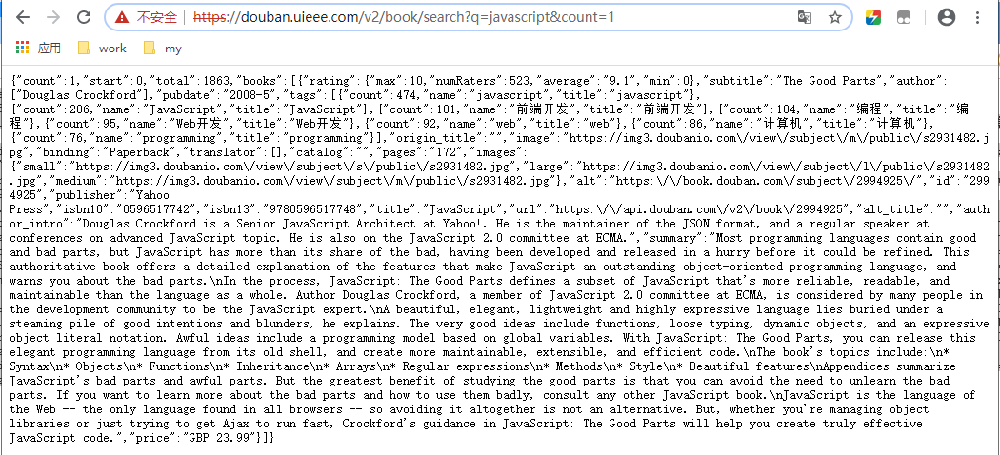

JSONP
==

## 同源策略
```text
要理解跨域，先要了解一下“同源策略”。
同源是指，域名、协议、端口相同。所谓“同源策略“，简单的说就是基于安全考虑，当前域不能访问其他域的东西。

在同源策略下，在某个服务器下的页面是无法获取到该服务器以外的数据的
```
* 常见的是否同源示例

URL |是否同源 |说明 
:--- |:--- |:--- 
http://www.a.com <br>https://www.a.com |不同源 |协议不同
http://www.a.com <br>http://www.b.com |不同源 |域名不同  
http://www.a.com:8080 <br>http://www.a.com:8090 |不同源 |端口不同  
http://www.a.com/a.js <br>http://www.a.com/b.js |同源 |域名、协议、端口相同  
http://www.a.com/abc/a.js <br>http://www.a.com/efg/b.js|同源 |域名、协议、端口相同  

* 跨域报错示例
    ```html
    <!DOCTYPE html>
    <html lang="en">
    <head>
        <meta charset="UTF-8">
        <title>ajax</title>
    </head>
    <body>
        <div id="mydiv">
            <button id="btn">点击</button>
        </div>
    </body>
    <script type="text/javascript">
        window.onload = function() {
    
        var oBtn = document.getElementById('btn');
    
        oBtn.onclick = function() {
    
            var xhr = new XMLHttpRequest();
    
            xhr.onreadystatechange = function() {
                if (xhr.readyState == 4 && xhr.status == 200) {
                        alert( xhr.responseText );
                }
            };
    
            xhr.open('get', 'https://douban.uieee.com/v2/book/search?q=javascript&count=1', true);
            xhr.send(); 
        };
    
    };
    </script>
    </html>
    ```
    报错：
      


### ``、`<link>`、`<script>`可跨域请求
    ```text
    的src  获取图片 
    <link>的href  获取css  
    <script>的src  获取javascript 
    
    这三个都不符合同源策略，它们可以跨域获取数据
    ```

## JSONP
```text
JSONP: JSON with padding，填充式JSON或参数式JSON
JSONP实现跨域请求的原理简单的说，就是动态创建<script>标签，然后利用<script>的src 不受同源策略约束来跨域获取数据

JSONP 由两部分组成：回调函数和数据
回调函数：
    是当接受到响应数据后接下来在页面中要调用的函数。回调函数的名字一般是在请求中指定的。
数据：
    就是传入回调函数中的JSON数据
```


### 理解jsonp
* 示例1  
现在我们在jsonp.html页面定义一个函数，然后在远程remote.js中传入数据进行调用

    * remote.js文件代码
        ```js
        localHandler({
            "result": "我是远程js带来的数据"
            }
        );
        ```

    * jsonp.html页面代码
        ```html
        <!DOCTYPE html>
        <html">
        <head>
            <title></title>
            <script type="text/javascript">
                
                // 回调函数一定要先于加载jsonp数据之前定义，因为该函数要被调用
                function localHandler(data){
                    alert('我是本地函数，可以被跨域的remote.js文件调用，远程js带来的数据是：' + data.result);
                };
            </script>
            <!-- 加载完这个js文件，解释js内容，其实就是在调用 localHandler()函数 -->
            <script type="text/javascript" src="http://remoteserver.com/remote.js"></script>
        </head>
        <body>
        
        </body>
        </html>
        ```
        ```text
        运行之后查看结果，页面成功弹出提示窗口，显示：
        我是本地函数，可以被跨域的remote.js文件调用，远程js带来的数据是：我是远程js带来的数据
        
        现实中远程的js文件是动态生成的，一般通过request中的callback参数来获得客户端期望要调用的客户端本地的回调函数名
        ```


* 示例2  
    * 了解豆瓣接口  
        https://douban.uieee.com/v2/book/search?q=javascript&count=1
         
        
        https://douban.uieee.com/v2/book/search?q=javascript&count=1&callback=handleResponse
         
    
        通过传参callback=handleResponse后，发现返回的数据做了如下包装，这是在调用handleResponse方法
        ```text
        ;handleResponse(
            json数据
        );
        ```
        ```text
        handleResponse函数名前为什么要加;
        因为：前端页面脚本压缩可减少脚本数量和脚本大小，
        为了避免压缩时前一个脚本没有写最后一个分号而导致压缩后脚本不能使用，
        所以要在开始加一个分号
        ```

    * 在页面中，返回的JSON作为参数传入回调函数中，我们通过回调函数来操作数据
        ```js
        function handleResponse(response){
            // 对response数据进行操作代码，response数据即服务端封装好的 json数据
        }
        ```
    * 动态创建`<script>`标签，设置其src，回调函数在src中设置
            ```js
            var script = document.createElement("script");
            script.src = "https://douban.uieee.com/v2/book/search?q=javascript&count=1&callback=handleResponse";
            document.body.insertBefore(script, document.body.firstChild);
            ```

    * 了解了JSONP的基本使用方法，我们在实现上面通过ajax调用豆瓣接口的需求，实现代码如下
        ```html
        <!DOCTYPE html>
        <html lang="en">
        <head>
            <meta charset="UTF-8">
            <title>JSONP实现跨域2</title>
        </head>
        <body>
            <div id="mydiv">
                <button id="btn">点击</button>
            </div>
        </body>
        <script type="text/javascript">
            // 先定义了一个函数handleResponse
            function handleResponse(jsonData){
                    console.log(jsonData);
            }
        </script>
        
        <script type="text/javascript">
            window.onload = function() {
                var oBtn = document.getElementById('btn');
            
                oBtn.onclick = function() {     
            
                    var script = document.createElement("script");
                    // 此处在加载候，就执行 handleResponse(jsonData), 这刚好就是脚本的内容
                    script.src = "https://douban.uieee.com/v2/book/search?q=javascript&count=1&callback=handleResponse";
                    document.body.insertBefore(script, document.body.firstChild);   
                };
            };
        </script>
        </html>
        ```

        在控制台，我们可以查看到返回的response数据格式为JSON对象格式的，具体需要取出哪些参数，可以根据自己的需要
         
### JSONP概述
```text
JSONP目前还是比较流行的跨域方式，虽然JSONP使用起来方便，
但是也存在一些问题： 
首先， JSONP 是从其他域中加载代码执行。如果其他域不安全，很可能会在响应中夹带一些恶意代码，
而此时除了完全放弃 JSONP 调用之外，没有办法追究。因此在使用不是你自己运维的 Web 服务时，一定得保证它安全可靠。

其次，要确定 JSONP 请求是否失败并不容易。虽然 HTML5 给<script>元素新增了一个 onerror事件处理程序，
但目前还没有得到任何浏览器支持。为此，开发人员不得不使用计时器检测指定时间内是否接收到了响应。
```


## jQuery封装JSONP
```text
对于经常用jQuery的开发者来说，能注意到jQuery封装的$.ajax中有一个dataType属性，
如果将该属性设置成dataType:"jsonp"，就能实现JSONP跨域了。

需要了解的一点是，虽然jQuery将JSONP封装在$.ajax中，但是其本质与$.ajax不一样
```

* 通过jQuery的$.ajax实现跨域的代码
    ```html
    <!DOCTYPE html>
    <html lang="en">
    <head>
        <meta charset="UTF-8">
        <title>jQuery实现JSONP</title>
        <script type="text/javascript" src="https://code.jquery.com/jquery-3.1.0.min.js"></script>
    </head>
    <body>
        <div id="mydiv">
            <button id="btn">点击</button>
        </div>
    </body>
    
    <script type="text/javascript">
        $(function(){
            $("#btn").click(function(){
                $.ajax({
                    async: true,
                    url: "https://douban.uieee.com/v2/book/search",
                    type: "GET",
                    dataType: "jsonp", // 返回的数据类型，设置为JSONP方式
                    jsonp: 'callback', // 传递给请求处理程序或页面的，服务端用于获得jsonp回调函数名的参数名，相当于request的callback=handleResponse传参
                    jsonpCallback: 'handleResponse', // 设置回调函数名，默认为jQuery自动生成的随机函数名，也可以写"?"，jQuery会自动为你处理数据
                    data: {
                        q: "javascript", 
                        count: 1
                    }, 
                    success: function(response, status, xhr){
                        console.log('状态为：' + status + ',状态是：' + xhr.statusText);
                        console.log(response);
                    }
                });
            });
        });
    </script>
    </html>
    ```
    ```text
    是不是有点奇怪？为什么我这次没有写flightHandler这个函数呢？而且竟然也运行成功了！
    哈哈，这就是jQuery的功劳了，jquery在处理jsonp类型的ajax时，
    自动帮你生成回调函数并把数据取出来供success属性方法来调用，是不是很爽呀？
    （还是忍不住吐槽，虽然jquery也把jsonp归入了ajax，但其实它们真的不是一回事儿），
    ```
    同等效果的写法  
    ```html
    <script type="text/javascript">
        function handleResponse(jsonData) {
            console.log(response);
        }
  
        $(function(){
            $("#btn").click(function(){
                $.ajax({
                    async: true,
                    url: "https://douban.uieee.com/v2/book/search",
                    type: "GET",
                    dataType: "jsonp", // 返回的数据类型，设置为JSONP方式
                    jsonp: 'callback', // 传递给请求处理程序或页面的，服务端用于获得jsonp回调函数名的参数名，相当于request的callback=handleResponse传参
                    jsonpCallback: 'handleResponse', // 设置回调函数名，默认为jQuery自动生成的随机函数名，也可以写"?"，jQuery会自动为你处理数据
                    data: {
                        q: "javascript", 
                        count: 1
                    }
                });
            });
        });
    </script>
    ```

    最后的结果与JavaScript通过动态添加`<script>`标签得到的结果是一样的
      

* 通过`$.getJSON()`跨域
    只要在地址中加上callback=?参数即可
    ```js
    $.getJSON(
        "https://douban.uieee.com/v2/book/search?q=javascript&count=1&callback=?", 
        function(data){
            console.log(data)
        }
    );
    ```
