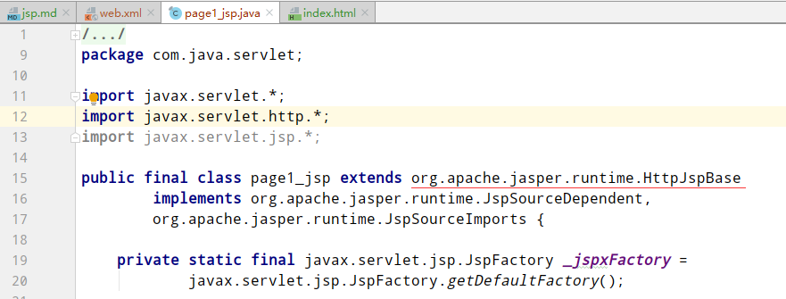
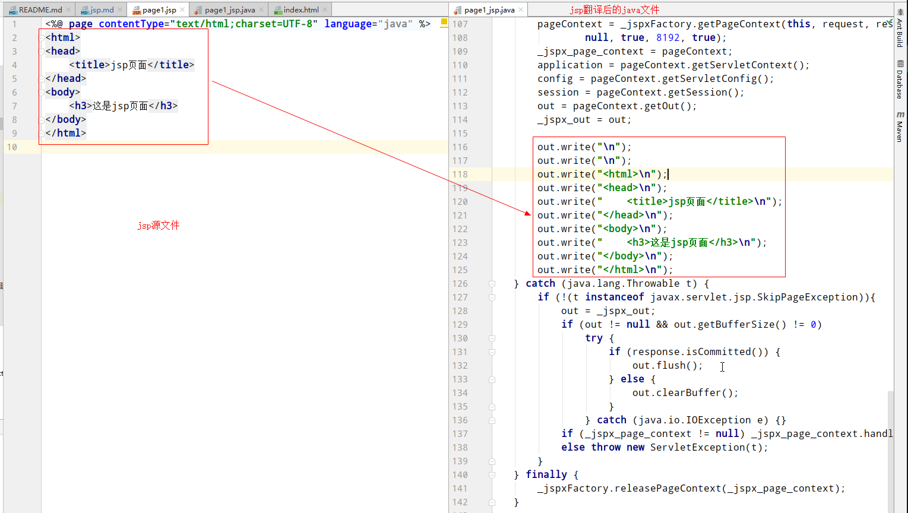
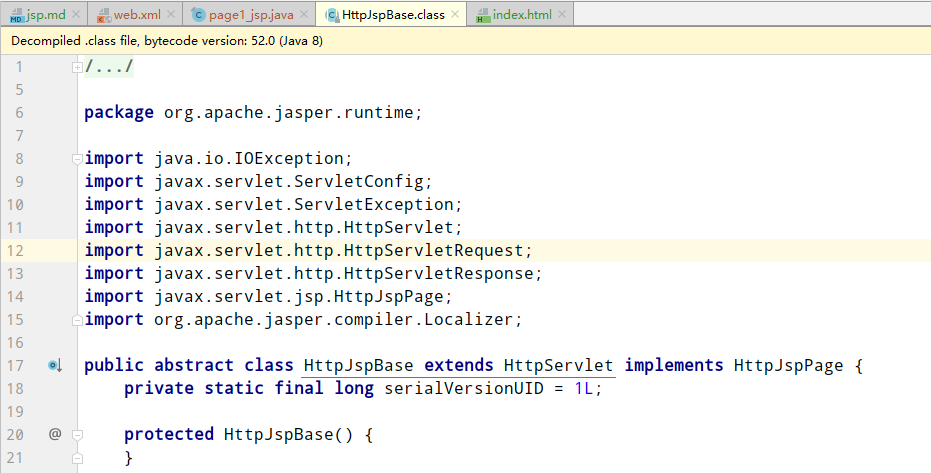
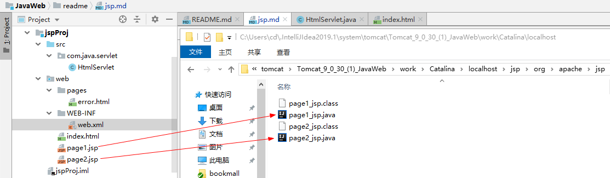

jsp
==


## jsp概述
JSP: Java Server Pages，Sun公司专门为了解决动态生成HTML文档的技术。方便html内容的输出

* 普通的Servlet程序输出html内容  
    [普通的Servlet输出html内容示例](../jspProj/src/com/java/servlet/HtmlServlet.java)  
    弊端：需要一行一行输出，很麻烦

## jsp本质
jsp的本质是Servlet程序

* [page.jsp源文件](../jspProj/web/page1.jsp)  
http://localhost:8080/jsp/page1.jsp

* 查看jsp文件翻译后的文件
    ```text
    运行idea的tomcat，注意查看Server日志，
    查看Using CATALINA_BASE显示的路径，在该目录下，work\Catalina\localhost\  找翻译出来的java文件
    如：
    ```
    ```text
    Using CATALINA_BASE:   "C:\Users\cd\.IntelliJIdea2019.1\system\tomcat\Tomcat_9_0_30_(1)_JavaWeb"
    Using CATALINA_HOME:   "D:\tomcat\apache-tomcat-9.0.30"
    Using CATALINA_TMPDIR: "D:\tomcat\apache-tomcat-9.0.30\temp"
    Using JRE_HOME:        "D:\java\jdk-12.0.1"
    Using CLASSPATH:       "D:\tomcat\apache-tomcat-9.0.30\bin\bootstrap.jar;D:\tomcat\apache-tomcat-9.0.30\bin\tomcat-juli.jar"
    ```

    ```text
    在目录C:\Users\cd\.IntelliJIdea2019.1\system\tomcat\Tomcat_9_0_30_(1)_JavaWeb\work\Catalina\localhost\jsp\org\apache\jsp
    ```
    翻译的java文件   
    [page1_jsp.java](../readme/page1_jsp.java)  
    
    page1_jsp.java翻译的java文件截图
      
    
      
    
    [org.apache.jasper.runtime.HttpJspBase类](../readme/HttpJspPage.java)  
      
    **由此可见，jsp其实就是一个HttpServlet程序(即servlet程序)**  
    
    jsp源文件与翻译的java文件对应关系  
    
    
    ```text
    查看jsp文件翻译的java文件时，需要添加依赖jar包
    在apache-tomcat程序的/lib
    
    el-api.jar
    jasper.jar
    jsp-api.jar
    tomcat-api.jar
    ```

* jsp文件何时翻译和编译
    ```text
    jsp文件在其首次被访问时(或有更新时)，翻译成java源文件，并编译成.class文件
    翻译的jsp文件命名规则：原jsp文件名_jsp.java
    ```


## jsp语法
```jsp
<%@ page contentType="text/html;charset=UTF-8" language="java" %>
```
```text
属性              含意
language        值只能是java，表示用java语言进行翻译
contentType     设置response header的Content-Type字段的值
pageEncoding    设置当前jsp文件的本身的编码
import          给当前jsp页面导入需要使用的类包
autoFlush		设置是否自动刷新out的缓冲区，默认为true，
                    即response的输出流out的缓冲区满后是否自动刷新，
                    如果不自动刷新，当内容超出了out缓冲区大小时，将报JSP Buffer overflow错误
buffer		    设置response的输出流out的缓冲区大小。默认为8KB
errorPage       设置当前jsp发生错误后，需要转发到哪个页面，定义错误页面，URL不跳转
isErrorPage	    设置当前jsp页面是否是错误页面，是的话，就可以使用exception异常对象
session		    设置当前jsp页面是否获取session对象，默认为true
extends		    设置jsp文件翻译后的类继承的类，给类似tomcat厂商预留的jsp默认翻译的servlet继承于什么类
```


### jsp的三种脚本语法
#### 1声明式脚本
```text

```

#### 2表达式脚本


#### 3代码脚本

## jps九大内置对象


## jsp四大域对象


## jsp常用标签


## 静态包含与动态包含的区别


