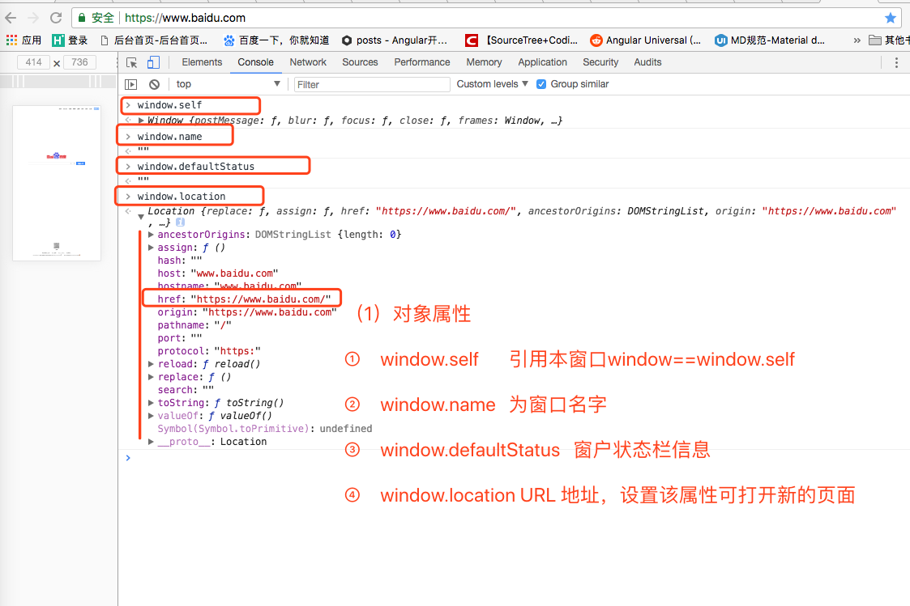
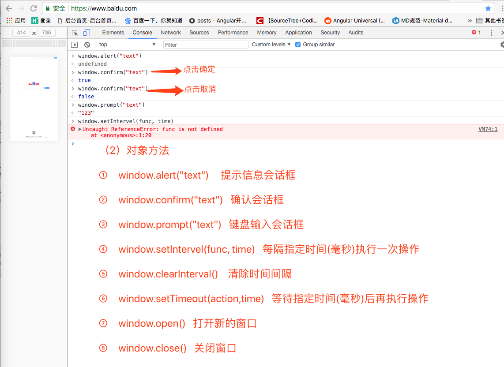
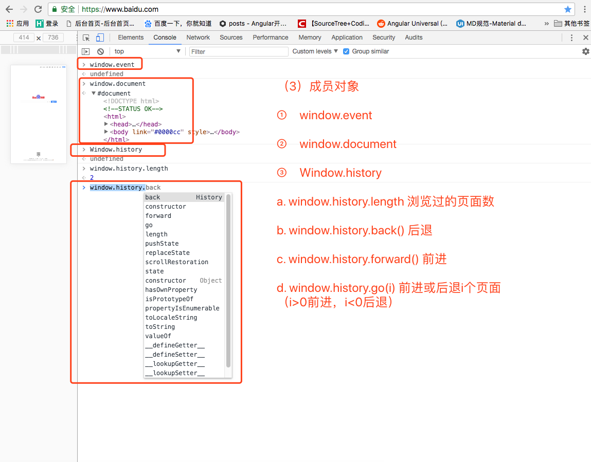
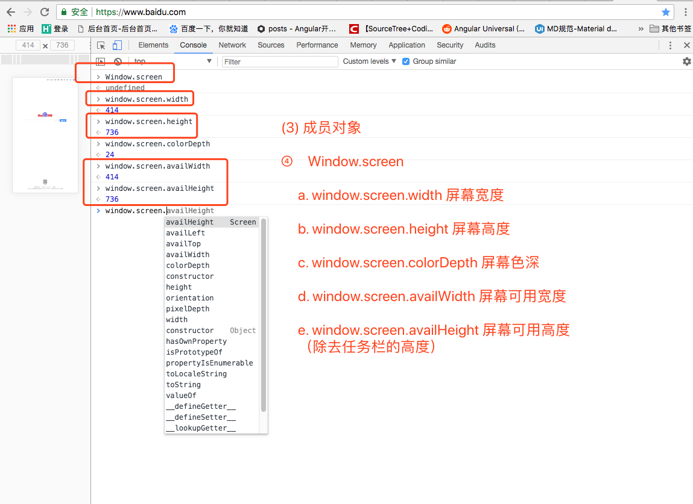
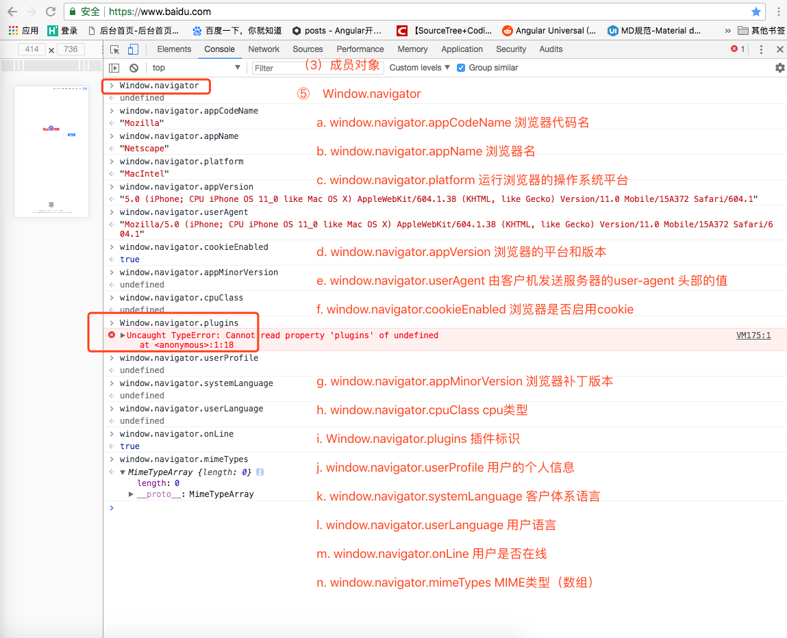
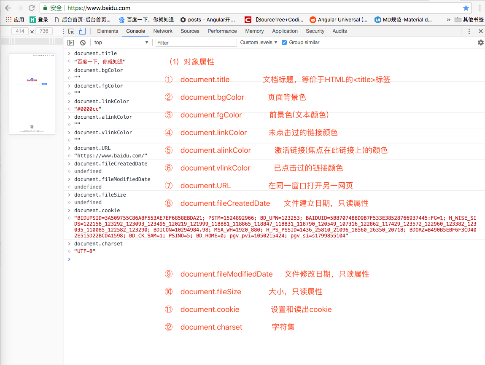
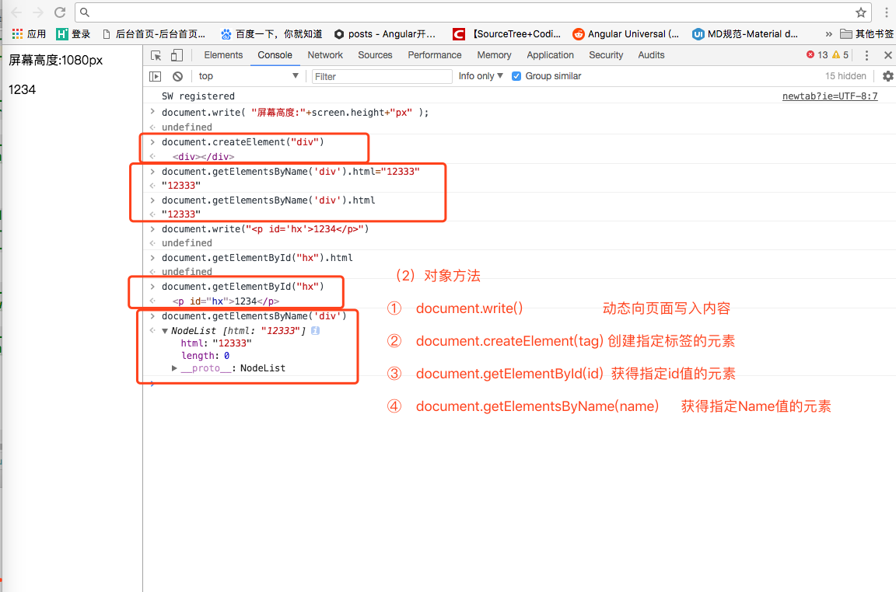
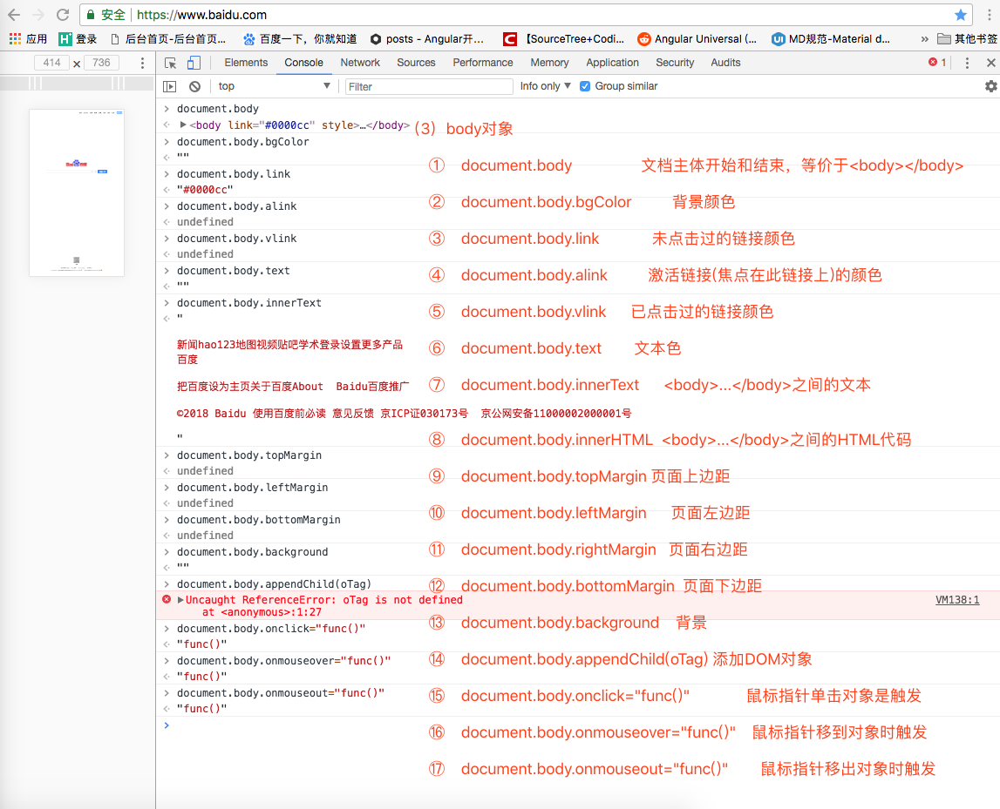
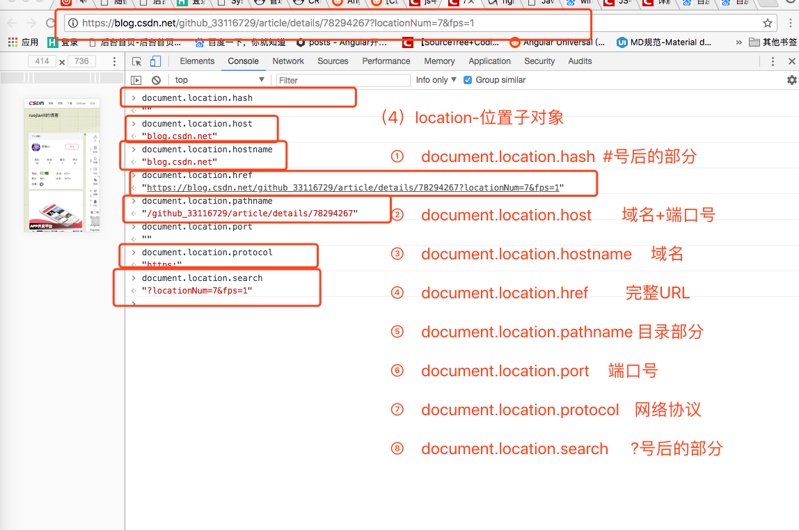
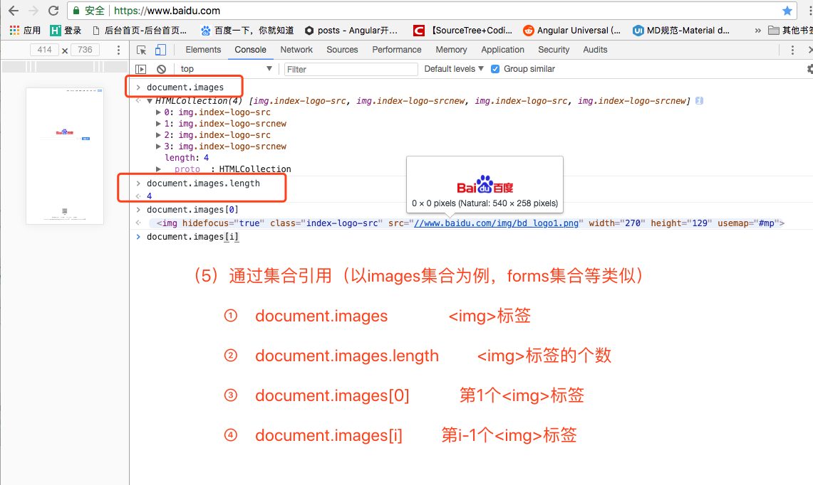

js中window对象和document对象
==

## 概述
```text
所有的全局函数和对象都属于Window对象的属性和方法

1、window 指窗体。Window 对象表示浏览器中打开的窗口。
document指页面。document是window的一个子对象、一个对象属性。

2、用户不能改变 document.location(因为这是当前显示文档的位置)。
     但是,可以改变window.location (用其它文档取代当前文档)
     window.location本身也是一个对象, 而document.location不是对象。
如果文档包含框架（frame 或 iframe 标签），浏览器会为HTML文档创建一个window对象，
并为每个框架创建一个额外的 window 对象。
document 对 Document 对象的只读引用。document 当前显示的文档(该属性本身也是一个对象)。
frame 窗口里的一个框架((FRAME>)(该属性本身也是一个对象)。
frames array 列举窗口的框架对象的数组,按照这些对象在文档中出现的顺序列出(该属性本身也是一个对象)。
```

## window对象
代表浏览器中一个打开的窗口。它是一个顶层对象，而不是另一个对象的属性。

### 对象属性
  

### 对象方法
  

### 对象成员
  

  

  


## document对象
代表整个HTML 文档，可用来访问页面中的所有元素。

### 对象属性
  

### 对象方法
  

### body对象
  

### location对象


### 通过集合引用（以images集合为例，forms集合等类似）


```text
补充：

a)通过name属性直接引用


document.images.oImage          //document.images.name属性
// ----------------------------

b)引用图片的src属性
document.images.oImage.src      //document.images.name属性.src

```