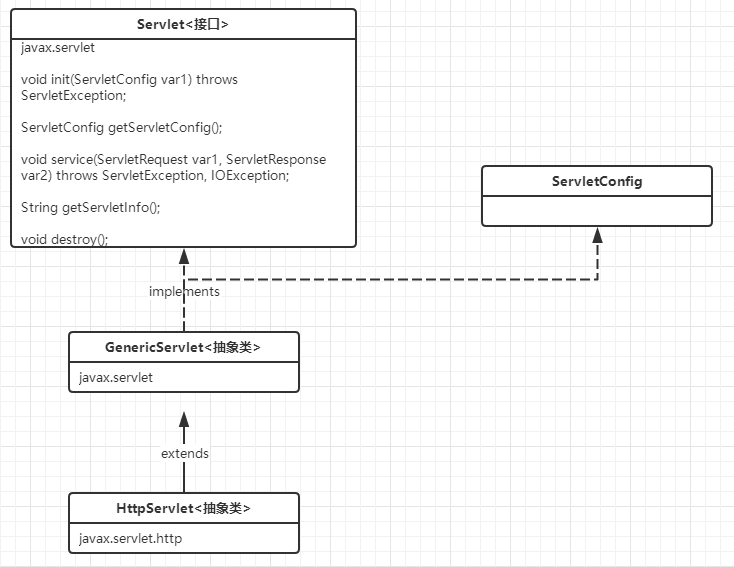

tomcat
==


## 概述
* java web
```text
Java web，是用java技术来解决相关web互联网领域的技术的总称。
简而言之：使用java语言实现浏览器可以访问的程序内容。
web包括：web服务器和web客户端两部分
```

## web资源分类
```text
web资源即放在Internet网上供外界访问的文件或程序
```
* 静态资源
    ```text
    静态网页文件：html文件、css文件、文本、音频、视频文件等
    ```
* 动态资源
    ```text
    jsp、Servlet、php程序等
    ```
    
## 常见的java web服务器
* Tomcat
    >免费，应用广泛。由Apache组织提供的一种Web服务器，提供对jsp和Servlet的支持
* Jboss
    >免费，个遵从JavaEE规范的、开放源代码的、纯Java的EJB服务器，它支持所有的JavaEE规范
* GlassFish
    >免费，应用少，由Oracle公司开发的一款Java Web服务器，是一款强健的商业服务器，达到产品级质量,
* Resin
    >收费，应用比较多。是CAUCHO公司的产品，是一个非常流行的服务器，对servlet和JSP提供了良好的支持，
     性能也比较优良。
* WebLogic
    >收费，用的不多，适合大公司.是BEA公司的产品，支持JavaEE规范    
* WebSphere
    >IBM公司的产品
* Jetty
    >更轻量级开源的servlet容器
    


## tomcat服务器安装部署
* **tomcat web服务器依赖java运行环境，即jre**，所以必须先配置好，java运行环境安装
见[安装JDK](https://github.com/cucker0/java_2019/blob/master/README/install_JDK.md)
* 下载tomcat包，http://tomcat.apache.org/
* 把下载的tomcat包解压到一个目录，目录中不带空格
* 配置tomcat系统环境变量
    ```text
    * 添加系统环境变量
        系统环境变量名：CATALINA_HOME
        值：上一步中tomcat的根路径，如D:\tomcat\apache-tomcat-9.0.30
      
    * 在Path系统变量中追加tomcat相关路径
        %CATALINA_HOME%\bin;%CATALINA_HOME%\lib
    ```

### 启动tomcat
* 启/停脚本
    * windows
        ```text
        * 启动tomcat服务
        运行 tomcat根目录\bin\startup.bat 脚本

        * 停止tomcat服务
        运行 tomcat根目录\bin\shutdown.bat 脚本
        ```
    * linux
        ```text
        * 启动tomcat服务
        运行 tomcat根目录/bin/startup.sh 脚本

        * 停止tomcat服务
        运行 tomcat根目录/bin/shutdown.sh 脚本
        ```
* catalina服务控制脚本（需要先配置tomcat环境变量）
    * 启动服务
        ```text
        catalina start
        ```
    * 停止tomcat服务
        ```text
        catalina stop
        ```

访问测试
```text
此时打开浏览器，访问 http://127.0.0.1:8080, 就能访问到tomcat的欢迎页
```


## tomcat目录
```text
.
├── bin     存放可执行文件目录        
├── conf    存放配置文件目录
    ├── catalina.policy     安全策略：SYSTEM CODE、CATALINA CODE、WEB APPLICATION权限控制，使用-security启动tomcat时生效
    ├── catalina.properties     package访问列表、package定义、指定loader加载器依赖的jar包等
    ├── context.xml             每个web app都会加载，指定WatchedResource等，
    ├── jaspic-providers.xml
    ├── jaspic-providers.xsd
    ├── logging.properties      登录相关配置
    ├── server.xml              站点配置，类似于nginx的server {}块，可配置监听端口、会话超时时间、http版本、目录(appBase)等
    ├── tomcat-users.xml        定义认证的用户、密码、角色等
    └── web.xml                 默认全局配置，所有的web app都应用，可配置欢迎页(默认文档)、mime-type等。这里配置了一个default servlet，URL路由映射为/
├── lib     存放相关jar包目录
├── logs    保存日志文件目录
├── temp    临时目录
├── webapps 存放应用工程目录
└── work    存放session序列化文件、jsp编译成Servlet程序的目录

```

* 端口配置
```xml
<!-- web.xml -->

    <Connector port="8080" protocol="HTTP/1.1"
               connectionTimeout="20000"
               redirectPort="8443" />
```


* 访问地址说明
```text
* http://ip:port/app/xx.html

http://     协议
127.0.0.1   是你要访问的服务器的IP地址
8080        是tomcat监听的端口号
app         是webapps 目录下的项目
xx.html   是这个目录下要访问的文件名

* http://ip:port
访问资源为 webapps/ROOT/ 的资源，
该URL访问的资源为 webapps/ROOT/index.html
```


## servlet
```text
Servlet是一个专门用来接收和响应客户端的请求的小web程序。

Servlet接口，sun公司定义一个servlet的规范，定义了servlet应该有哪些方法，以及方法需要的参数
```


### Servlet接口与实现类结构关系
  

### 手动实现Servlet接口

### 使用idea创建Servlet
