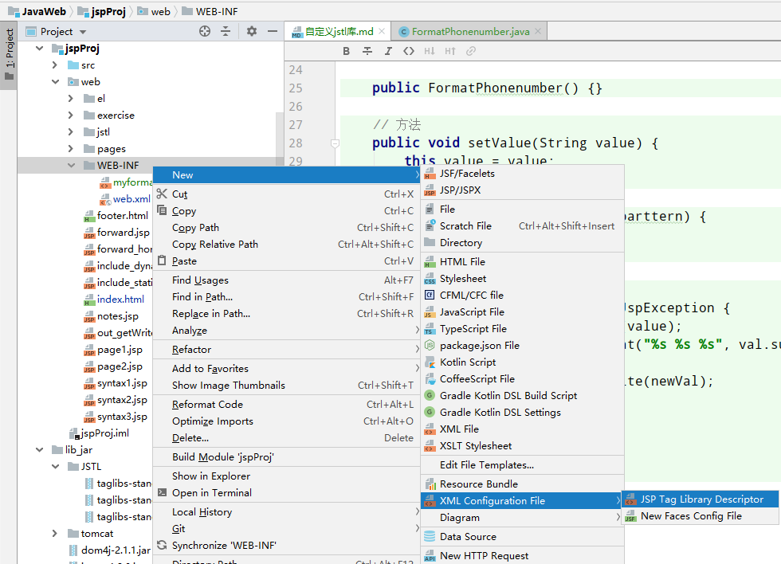

自定义jstl库
==


## 自定义jstl标签
### 编写标签处理器类
```text
Tag Handle Class
可以编写多个 标签处理器类。    
如: 写一个格式化手机号功能的标签
```
[FormatPhonenumber](../jspProj/src/com/java/jstl/FormatPhonenumber.java)

```java
package com.java.jstl;


import javax.servlet.jsp.JspException;
import javax.servlet.jsp.tagext.TagSupport;
import java.io.IOException;

/**
 * 对手机号字符串格式化
 * 如:
 * 1xx xxxx xxxx
 */
public class FormatPhonenumber extends TagSupport{
    private String value;
    private String parttern;

    public FormatPhonenumber() {}

    // 方法
    public void setValue(String value) {
        this.value = value;
    }

    public void setParttern(String parttern) {
        this.parttern = parttern;
    }

    @Override
    public int doStartTag() throws JspException {
        String val = String.valueOf(value);
        String newVal = String.format("%s %s %s", val.substring(0, 3), val.substring(3, 7), val.substring(7));
        try {
            pageContext.getOut().write(newVal);
        } catch (IOException e) {
            e.printStackTrace();
        }
        return super.doStartTag();
    }
}
```


### 编写标签库描述文件
```text
Tag Library Descriptor  
在项目的web/WEB-INF/目录下新建 一个标签库描述文件(.tld)
可以添加多个tag  

WEB-INF/目录下的文件会被tomcat启动时加载，
tld文件里配置了，库的short-name、uri、标签与类对应关系及属性要求、函数与方法对应关系、函数名等
修改tld文件需要重启tomcat才能生效

第三方的taglibs库，每个jar文件根目录下也是有一个.tld文件
```
如 [myformat.tld](../jspProj/web/WEB-INF/myformat.tld)
```xml
<?xml version="1.0" encoding="UTF-8"?>

<taglib xmlns="http://java.sun.com/xml/ns/javaee"
        xmlns:xsi="http://www.w3.org/2001/XMLSchema-instance"
        xsi:schemaLocation="http://java.sun.com/xml/ns/javaee http://java.sun.com/xml/ns/javaee/web-jsptaglibrary_2_1.xsd"
        version="2.1">

    <tlib-version>1.0</tlib-version>
    <!-- 标签库的简单名字，即prefix -->
    <short-name>myfmt</short-name>
    <uri>http://www.java.com/myformat</uri>

    <!-- Invoke 'Generate' action to add tags or functions -->
    <tag>
        <!-- 标签名 -->
        <name>formatPhone</name>
        <tag-class>com.java.jstl.FormatPhonenumber</tag-class> <!-- 与前面写的标签处理器类关联 -->
        <body-content>JSP</body-content>
        <attribute>
            <name>value</name>
            <required>true</required>
            <rtexprvalue>true</rtexprvalue>
        </attribute>
        <attribute>
            <name>parttern</name>
            <required>false</required>
            <rtexprvalue>false</rtexprvalue>
        </attribute>
    </tag>
</taglib>
```



### JSP页面中引用自定义库
在JSP页面中引入自定义库，注意uri要与 tld文件里的一致
```xml
<%@ taglib prefix="myfmt" uri="http://www.java.com/myformat" %>
```

[使用自定义库示例](../jspProj/web/jstl/custom/my_format.jsp)

## 自定义jstl函数
与自定义jstl标签基本相同

### 编写函数处理方法
在一个类里编写静态方法  
[MyFunctions](../jspProj/src/com/java/jstl/MyFunctions.java)
```java
package com.java.jstl;

import java.time.LocalDate;

/**
 * 自定义jstl函数库
 */
public class MyFunctions {
    /**
     * 获取年份
     * @return
     */
    public static String getYear() {
        LocalDate date = LocalDate.now();
        return String.valueOf(date.getYear());
    }

    /**
     * 判断年龄是否成年了
     * @param age
     * @return
     *     true: 成年了
     *     false: 未成年
     */
    public static Boolean isAdult(int age) {
        return age >= 18 ? true : false;
    }
}

```


### 编写标签库描述文件
```text
指定short-name、uri，可以添加多个函数
```
```xml
<?xml version="1.0" encoding="UTF-8"?>

<taglib xmlns="http://java.sun.com/xml/ns/javaee"
        xmlns:xsi="http://www.w3.org/2001/XMLSchema-instance"
        xsi:schemaLocation="http://java.sun.com/xml/ns/javaee http://java.sun.com/xml/ns/javaee/web-jsptaglibrary_2_1.xsd"
        version="2.1">

    <tlib-version>1.0</tlib-version>
    <short-name>myfn</short-name>
    <uri>http://www.java.com.functions</uri>

    <!-- Invoke 'Generate' action to add tags or functions -->
    <function>
        <!-- 方法名 -->
        <name>getYear</name>
        <function-class>com.java.jstl.MyFunctions</function-class>
        <function-signature>
            java.lang.String getYear()
        </function-signature>
    </function>

    <function>
        <!-- 方法名 -->
        <name>isAdult</name>
        <function-class>com.java.jstl.MyFunctions</function-class>
        <function-signature>
            java.lang.Boolean isAdult(int)
        </function-signature>
    </function>

</taglib>
```

### JSP页面中使用自定义函数
与自定义的标签使用方法相似   
```text
<%@ taglib prefix="myfn" uri="http://www.java.com.functions" %>
```

[自定义函数示例](../jspProj/web/jstl/custom/my_functions.jsp)
